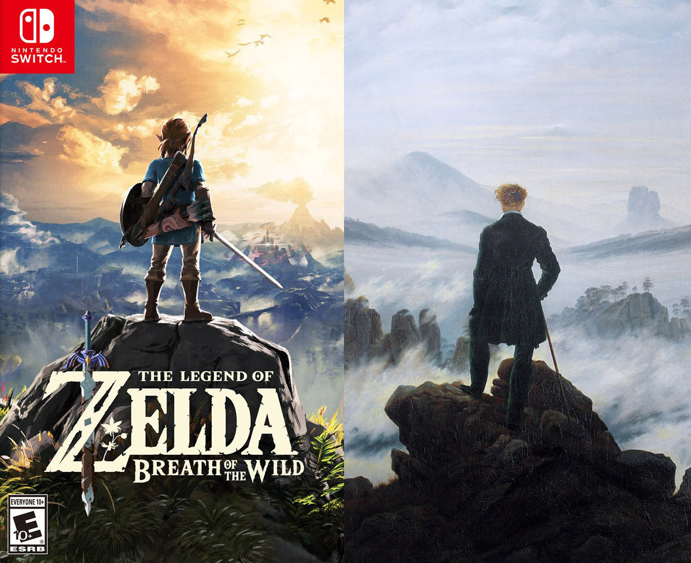

---
title: Projecte IOC 2022
subtitle: Especialitat de Dibuix
author: Xavier Belanche Alonso
date: 15/02/2002
lang: ca
mainfont: Helvetica
documentclass: extarticle
fontsize: 11pt
linestretch: 1.5
papersize: a4
geometry: left=3.5cm,right=3cm,top=2cm,bottom=3cm
urlcolor: blue
toc: true
pandocomatic_:
  use-template: pdf
...

<!--
https://www.academia.edu/44259087/La_dimensi%C3%B3_digital_en_situacions_escolars_de_confinament_i_postconfinament

https://www.uoc.edu/opencms_portal2/opencms/CA/coronavirus/experts/estudiar-online/list.html
-->

Aquest document ha estat bellament editat amb el llenguatge de marques [Markdown](https://www.markdownguide.org/) i exportat a \LaTeX\ gràcies a la navalla suïssa de la conversió de formats [Pandoc](https://pandoc.org/), el cos de lletra és d'11pts, la tipografia és Helvetica, l'interlineat és de 1.5, les figures i diagrames han estat definides amb el llenguatge [DOT](https://es.wikipedia.org/wiki/DOT), processades amb el conjunt d'eines de visualització infogràfiques [Graphviz](https://graphviz.org/) i, finalment, incloses en el document amb al filtre *[pandoc-plot](https://github.com/LaurentRDC/pandoc-plot)*. Podeu consultar el codi font i històric del document a: [https://github.com/xbelanch/Projecte-IOC](https://github.com/xbelanch/Projecte-IOC)

# Motivació i interessos

El disseny, la redacció i presentació del projecte amb l'objectiu d'optar a la vacant de l'especialitat de Dibuix a l'Institut Obert de Catalunya (IOC) és un fet que convida necessàriament a una reflexió personal sobre el recorregut realitzat fins ara (vaig incorporar-me l'any 2008), així com els nombrosos reptes que es derivin de la voluntat de continuar a l'IOC quatre anys més (2022-2026).

L'IOC, per la seva naturalesa com a centre de referència en l'àmbit de la *formació a distància i de les noves oportunitats* per als estudiants, representa també una oportunitat per al professorat en la reinvenció i actualització permanent de la seva tasca docent. Gràcies als tretze anys (2008-2022) que he exercit com a docent a l'IOC, he participat de la seva història així com la de ser testimoni directe d'una fotografia de conjunt del seu funcionament que, en definitiva, m'ha aportat (i em continua aportant) un coneixement i una experiència professional inèdita en relació amb un projecte educatiu que, personalment considero, d'ensenyament-aprenentatge (EA) a Internet. D'altra banda, la singularitat de l'IOC obre una porta a desenvolupar un perfil professional més polivalent, transversal i, per tant, no confinat únicament a la pràctica docent. En aquest sentit, aquest exercici polièdric
Fet d'això són els diferents projectes de caràcter transversal que he pres part activament tant en el procés de creació com implantació.

##  Projectes a l'IOC (2008 - 2021)

Una de les estratègies efectives d'apoderament com a propi el centre de treball és la participació i col·laboració en la realització i consecució de projectes de caràcter transversal. Per la meva part, complementant la docència com a professor responsable del disseny dels recursos i activitats de les matèries de l'especialitat de Dibuix (**Fonaments de les arts I**, **Dibuix artístic**, **Volum**, **Tècniques d'expressió graficoplàstica**), he contribuït activament en l'assoliment de projectes transversals de centre que enumero a continuació:

**LAIA**: Creus que hauria d'incloure els tres anys al Departament d'Educació com a tècnic docent?

* De l'any 2009 fins al 2011 vaig coliderar el **procés de transició de la creació i publicació de materials d'estudi de l'FP**: del servei d'una empresa associada a la producció de materials de la UOC[^eurekamedia] a la d'un entorn wiki de creació pròpia[^wiki]. Aquest colideratge o treball horitzontal entre els diferents actors implicats (equip directiu, professorat, enginyers informàtics, editors, grafistes) va afavorir la consolidació d'una infrestructura interna de l'IOC ([https://dokuwiki.ioc.cat/doku.php](https://dokuwiki.ioc.cat/doku.php)) que és vigent i operativa a dia d'avui.
* De l'any 2011 fins al 2018 vaig participar en el desenvolupament del projecte **miniops**[^miniops], cursos oberts, interdisciplinaris i de curta durada (15 a 20 hores) disponibles per a la comunitat educativa, però estratègics en els estudis del GES (permeten acreditar mòduls optatius), tant com a ideòleg com a responsable del disseny web. Des del 2019 fins el dia d'avui, col·laboro en el disseny i desenvolupament tècnic del miniop *Llegir en xarxa*.
* Des del 2014 fins al 2016 vaig col·laborar, per una banda, amb la direcció de l'IOC per a la implementació del cicle formatiu de grau superior d'**Animacions 3D, jocs i entorns interactius** i, d'altra banda, la redacció de dos unitats formatives: *Generació de textures procedimentals 2D i 3D i mapa de bits*[^uf1] i *Introducció al disseny de videojocs*[^uf2].
* Al 2015 vaig definir el disseny de cobertes dels materials d'estudi de la **Formació Pedagògica i Didàctica** (FPD)[^fpd] i la realització del recurs *Repositori audiovisual d’educació de la Formació pedagògica i didàctica per exercir de professor*[^fpdvideos].
* Participació en diferents **equips de millora dels estudis de Batxillerat**, en particular en el disseny i creació de documents marc del professorat responsable i col·laborador.
* El març del 2020 vaig compartir amb la direcció acadèmica de Batxillerat una **proposta de projecte de *materials***[^projecte_materials] per als estudis de Batxillerat on es recollia, en primer lloc, una anàlisi de l'estat actual de les diferents estratègies de creació i publicació de recursos d'aprenentatge i, finalment, unes recomanacions dels trets bàsics que haurien de
* Actualment (2021-2022) formo part com a *assessor* de l'equip de millora de materials de **Proves d'Accés a Cicles Formatius de Grau Superior** (PACFGS).

[^wiki]: En una primera fase, l'IOC va contractar els serveis d'una empresa externa ([Scopia](https://www.scopia.es/) per a la importació dels materials d'FP (en format PDF) a una wiki personalitzada  basada en la plataforma de codi lliure [Dokuwiki](https://www.dokuwiki.org/dokuwiki).

[^eurekamedia]: *Eureka media* llavors, avui *Oberta Publishing*.

[^miniops]: Vegeu [http://miniops.ioc.cat/](http://miniops.ioc.cat/)

[^fpd]: Vegeu [https://ioc.xtec.cat/educacio/fpd](https://ioc.xtec.cat/educacio/fpd)

[^fpdvideos]: Vegeu la pàgina del repositori de vídeos de l'FPD: [http://fpd.ioc.cat/videos/](http://fpd.ioc.cat/videos/)

[^uf1]: Consulteu en aquesta adreça el material d'estudi: [https://ioc.xtec.cat/materials/FP/Recursos/fp_a3d_m04_/web/fp_a3d_m04_htmlindex/media/fp_a3d_m04_u4_pdfindex.pdf](https://ioc.xtec.cat/materials/FP/Recursos/fp_a3d_m04_/web/fp_a3d_m04_htmlindex/media/fp_a3d_m04_u4_pdfindex.pdf)

[^uf2]: Consulteu en aquesta adreça el material d'estudi: [https://ioc.xtec.cat/materials/FP/Recursos/fp_a3d_m07_/web/fp_a3d_m07_htmlindex/media/fp_a3d_m07_u3_pdfindex.pdf](https://ioc.xtec.cat/materials/FP/Recursos/fp_a3d_m07_/web/fp_a3d_m07_htmlindex/media/fp_a3d_m07_u3_pdfindex.pdf)

[^projecte_materials]: Descarregueu des d'aquest enllaç el document del projecte: [http://rotterlyud.ddns.net:5000/sharing/dljdfasQS](http://rotterlyud.ddns.net:5000/sharing/dljdfasQS)

<!-- TODO: Cal modificar el títol de la secció -->
# Prospecció prèvia a la definició del projecte

<!-- TODO: Cal refer el paràgraf -->
L'actual proposta de projecte comparteix el mateix punt de partida que els realitzats anteriorment a l'IOC: tots ells, en particular la proposta de materials per als estudis de Batxillerat, els *miniops* i la *wiki* d'FP, van mirar d'aportar una resposta a aquelles qüestions o reptes sobrevinguts per una necessitat estructural de la pròpia institució. Per tant, davant del requeriment professional en definir i defensar un nou projecte per a l'IOC, crec necessari una anàlisi previ de qüestions vinculades tant amb l'actualitat educativa com aquelles més específiques o pròpies de la realitat de l'IOC amb la finalitat que e permetin modelar la definició i objectius de la proposta de projecte.

Personalment identifico dues qüestions:

* L'IOC davant de la transformació digital de l'educació.
* Reptes i oportunitats dels estudis de la modalitat d'arts al batxillerat de l'IOC.

## L'IOC davant de la transformació digital de l'educació

>En línia: el procés d’ensenyament-aprenentatge té lloc només a través de la tecnologia. Docent i estudiant interactuen a distància, fora de l’aula física, i normalment es requereix connexió a la Xarxa i l’ús de dispositius digitals. Cal diferenciar-la de l’educació a distància, que, històricament, ha abastat cursos de correspondència, televisió educativa i videoconferència.
>
>pag 32 *Educació híbrida Com impulsar la transformació digital de l’escola*.

Arran de la COVID-19 (març de 2020), el Departament d'Educació es va veure precipitat a adoptar mesures urgents en el transcurs del tancament de les escoles presencials. La més important va ser la virtualització general de l'activitat escolar. Per més que els diferents governs i institucions educatives havien impulsat actuacions importants en el procés de la digitalització de les escoles  a nivell de formació i recursos[^xtec] com també de dotació d'infraestructures de xarxes i dispositius als centres educatius (*Educat 1x1*), va ser manifest que una part significativa del sistema educatiu no estava en condicions de mantenir un aprenentatge híbrid i una presencialitat discontínua[^serarols] de manera òptima, fet que va augmentar les diferències d'equitat i igualtat d'oportunitats "en els col·lectius de més vulnerabilitat (...). El tancament de escoles va fer palesa la bretxa digital i cognitiva existent entre els alumnes."[^pla_actuacio_covid]. La conseqüència més immediata va ser l'acceleració del [**Pla d'educació digital de Catalunya 2020-2023**](https://educacio.gencat.cat/ca/departament/linies-estrategiques/pla-educacio-digital/) que persegueix els objectius de consolidar, per una banda, que "els alumnes de Catalunya siguin digitalment competents en acabar l'ensenyament obligatori" i la competència digital docent "entesa com una competència clau del segle XXI" i, d'altra banda, la reducció de la *bretxa digital* a través de programes d'inversió en equipament i dotació universal de connectivitat i dispositius per a les famílies com d'infraestructures renovades per als centres[^literatura].

[^serarols]: Serarols i Badia, Jordi, *La dimensió digital en situacions escolars de confinament i postconfinament*, Revista d'Organització Educativa i Gestió Educativa, 2020.

[^xtec]: Entre molts altres, els més significatius seria l'oferta de cursos presencials i telemàtics organitzats des de l'XTEC des de fa gairebé treinta anys; la disponibilitat de recursos educatius a través de portals com *edu365.cat*; plataformes de centre basades com la *Intraweb* o *Agora* (Moodle de centres) o els repositoris de recursos educatius exitents disponibles al catàleg [Merlí](https://merli.xtec.cat/merli/cerca/directoriInicial.jsp) i [Alexandria](https://alexandria.xtec.cat/))

[^pla_actuacio_covid]: Document oficial del govern *Pla d'actuació per al curs 2021-2022 per a centres educatius en el marc de la pandèmia, maig de 2021* (maig de 2021) disponible a [https://govern.cat/govern/docs/2021/05/20/15/13/1a5993db-0432-42b3-a600-75f8a12fea88.pdf](https://govern.cat/govern/docs/2021/05/20/15/13/1a5993db-0432-42b3-a600-75f8a12fea88.pdf)

[^literatura]: Podem trobar força referències tant des de l'òptica periodística ([*De l’aula presencial a l’aula virtual*](https://criatures.ara.cat/escola/aula-presencial-virtual-confinament-coronavirus-covid-19_1_1175711.html)), divulgativa ([*En només un any, l’ensenyament ha experimentat un canvi digital profund*](https://internetsegura.cat/digitalitzacio-ensenyament-covid/)), fins a aquelles accions per part de l'administració educativa recollides pels mitjans de comunicació, com la creació de la figura dels [mentors digitals](http://xtec.gencat.cat/ca/centres/mentors-digitals/): [*272 mentors formaran docents per adaptar els projectes educatius a la digitalització*](https://www.ccma.cat/324/272-mentors-formaran-docents-per-adaptar-els-projectes-educatius-a-la-digitalitzacio/noticia/3113152/)).

El canvi dràstic (i clau) del format de fer classes presencials a una modalitat exclusivament *virtual* va significar l'introducció espontània i diversificada de metodologies associades als recursos i eines que el professorat dels centres educatius mai (o parcialment) abans havien treballat amb els estudiants. Per una banda, el buït de la interacció entre professorat i estudiants es va omplir des de les trucades telefòniques a les videoconferències (*Google Meet*, *Zoom*, *Jitsi*, *Microsoft Teams*...) i, d'altra banda, l'adopció d'un EVA que dones una resposta àgil al professorat per publicar els recursos d'aprenentatge com les activitats (*Google Classroom* i *Moodle*). Cada escola i institut va escollir l'eina que li va semblar més adequada[^moodle-google-classroom].

No és un coincidència que els sistemes de comunicació síncrona van experimentar un desenvolupament accelerat gràcies no únicament a la virtualització de la pràctica educativa, sinó a tot els nivells de la societat, tan personals com professionals. Dit d'una altra manera, la pandèmia va significar el catalitzador d'un estat d'Internet que, des del 2010, ja estava definint els contorns del present actual. Per una banda, l'impacte que ha significat Internet en les relacions socials com professionals: la ubiqüitat i predomini dels telèfons intel·ligents (*smartphones*) com a dispositiu de principal de comunicació i accés a Internet, les xarxes socials (*Twitter*, *Instagram*, *TikTok*, *Discord*, *Reddit*...) com a espais de conversa i discussió globals que configuren l'opinió pública i, fins i tot, representen una veu crítica en la configuració de l'agenda periodística com de la política; la indústria de les dades personals (*Big data*) i la seva aplicació en el món educatiu (*Learning analytics*), l'*extimitat*[^extimitat] i els problemes associats a la seguretat i privacitat de les dades personals; el núvol (*cloud storage* i *computing*) ja no únicament com a dispositiu invisible i ubic d'emmagatzematge sinó com a una infraestructura clau de l'Internet actual (*Amazon Web Services*); i, sobretot, la concreció del concepte de reproducció en línia (des de les plataformes de pel·lícules i sèries de TV com *Netflix*, *HBO*, *Disney* o *Amazon Prime* a aquelles que són els usuaris els principals protagonistes en la creació en directe de "continguts" com *Twitch*, *Youtube Live*), motiu de canvi fulminant en la manera que avui dia consumim l'oferta cutural i audiovisual[^catala] a través dels diferents dispositius amb pantalla.

[^extimitat]: Forns, Albert, *Los diarios personales en tiempos de «extimidad»* (11 de gener de 2021), [https://lab.cccb.org/es/los-diarios-personales-en-tiempos-de-extimidad/](https://lab.cccb.org/es/los-diarios-personales-en-tiempos-de-extimidad/).

[^catala]: I el que tot això ha tingut d'impacte (no especialment positiu) de la presència i ús de la llengua catalana en aquest context ([*La quota del 6% de català no afectarà plataformes com Netflix, HBO o Amazon Prime*](https://www.ccma.cat/324/la-quota-del-6-de-catala-no-afectara-plataformes-com-netflix-hbo-o-amazon-prime/noticia/3132866/)) o l'article del Pere Ricart: [*Què s’està fent en català? (I) – Twitch*](https://www.nuvol.com/pantalles/cultura-digital/que-sesta-fent-en-catala-i-twitch-215300))

[^moodle-google-classroom]: Vegeu, per exemple, la notícia del març del 2020, [*Dues setmanes sense escola: com lluiten els mestres contra la bretxa digital?*](https://www.ccma.cat/324/dues-setmanes-sense-escola-com-lluiten-els-mestres-contra-la-bretxa-digital/noticia/3000448/) i la del juny de 2020: [*Moodle o Google ClassRoom? Acord d'Educació i Xnet per a la digitalització de les aules*](https://www.ccma.cat/324/moodle-o-google-classroom-acord-deducacio-i-xnet-per-la-digitalitzacio-de-les-aules/noticia/3019411/).

Sobre aquest fons d'interrupció de la pràctica educativa presencial acompanyada de l'irrupció de solucions virtuals, crec que té una especial rellevància citar les dues actuacions públiques de l'IOC: per una banda, a requeriment del Departament d'Educació, l'IOC va posar en obert els cursos dels estudis de Batxillerat al portal Eix en format d'aula de Moodle[^2] i, d'altra banda, juntament amb col·laboració amb l'ICE, va publicar una [iniciativa d'assessorament sobre virtualització de l'ensenyament](https://www.uab.cat/web/sala-de-premsa/detall-noticia/l-ice-uab-i-l-ioc-llancen-una-iniciativa-d-assessorament-sobre-virtualitzacio-de-l-ensenyament-1345829508832.html?detid=1345811490672) que es concretarà en el document [Idees en línea](https://sites.google.com/ioc.cat/ideesenlinia/presentaci%C3%B3)[^manresa-bujosa].

[^2]: Vegeu la notícia [*El Departament d’Educació reforça els recursos educatius a internet que ofereix a professors i alumnes a través de quatre portals: EIX, NODES, ODISSEA i IOC*](https://twitter.com/324cat/status/1241640255763120128) i [*Cursos IOC - Batxillerat*](https://educaciodigital.cat/ioc-batx/moodle/) al portal *Eix*.

[^manresa-bujosa]: Recomanaria especialment les intervencions de Catina Bujosa, professora dels estudis del GES i FP de l'IOC i coordinadora del projecte [miniops](http://miniops.xtec.cat), i Mireia Manresa, professora associada del departament de didàctucade Llengua i Literatura i professora de l'Institut de Ciències de l'Educació (ICE) de la UAB.

Més enllà de la seva valoració qualitativa, les dues actuacions representen una evidència del que ja es pot deduir d'una lectura crítica del PEC de l'IOC. En poques paraules: un disseny d'aula subjecte al format específic d'un EVA (Moodle) que ha de garantir l'autonomia i flexibilitat de l'estudiant. No és casual que al citat document anterior es plantegin diferents temàtiques que afecten i questionen aquest disseny d'aula: com motivar l'estudiantat *perquè es vinculin a allò que els volen fer treballar*? quines són les maneres de *mantenir-los connectats i evitar que abandonin en un context en línia*? Quines són les millors estratègies informatives *per a que l'alumnat sàpiga què li estem demanant?*. En resum, els reptes que planteja la pràctica d'EA a distància es podria concretar en els reptes següents:

* La comunicació immediata, *síncrona*, la socialització, la interacció diària, l'ús de l'humor, la ironia, la complicitat, el treball amb parelles o amb grup dels estudiants no és possible en la realitat d'un EA a distància en comparació amb la realitat diaria de la presencialitat. Això exigeix un exercici de prudència i previsió davant de l'exigència explícita del tret més representatiu de l'EA a distància, la comunicació *asíncronica*: com a professorat, ser curosos i utilitzar recursos comunicactius on s'accentui la *cortesia* amb els estudiants amb els que no hi ha un contacte directe i, per tant, desconeixem la seva realitat personal i professional. La idea d'*hospitalitat* en clau de lectura filosòfica de Byung-Chul Han[^hospitalitat]: *l'alternativa a l'acumulació del mateix, de la uniformitat, és recuperar la comunicació amb l'altre, exposar-se a la seva mirada, la seva veu i el seu pensament*.
* L'absència d'una rutina social pròpia de la pràctica educativa presencial en el context dels estudis a distància és un dels principals motius de la *desconnexió*, *manca d'interés* i *abandonament* dels estudiants (per no parlar del *lurkisme*[^lurker] com a fenomenologia d'un perfil d'estudiant que, en realitat, no deixa de ser una exposició sobrevinguda de la cultura d'Internet). El disseny d'aules *a distància* poden acabar convertint-se en espais administratius on predomina, sobretot, l'autoaprenentatge individual de l'estudiant. L'elevat grau d'abstracció de l'aprenentatge a distància  es transforma, malauradament, en una barrera en la comprensió i
apoderament dels estudiants del que estan fent. Augmenta, en definitiva, el rol passiu i invisible de l'estudiant.
* Les dificultats de familiarització amb l'entorn d'aprenentatge virtual (EVA) amb una sensació de manca d'operativitat davant dels reptes, tasques o activitats formulades en el context de les pràctiques didàctiques a l'aula virtual. Aquesta difucultat pot incrementar-se en relació amb el nivell de competència i recursos digitals dels estudiants (molt dispar a l'IOC): no tots els estudiants, com es va detectar el 2020 sota la pandèmia, disposen d'una infraestructura de connectivitat i dispositius d'accés a Internet òptim adient. Això pot, fins i tot, planetjar un problema de concepte: el professorat que dissenya i crea les aules virtuals pensen amb la realitat diversa i irregular dels estudiants o, altrament, des d'una perspectiva "ideal" on hi ha una correspondència e
* L'elevat nombre d'estudiants i, per tant, la necessària incorporació de col·laboradors en la tasca de comunicació asíncrona i gestió de l'aula pot accentuar un enfocament o aplicació "passiu" de la pràctica d'EA i afavorir encara més la *distància* entre els estudiants i el professorat i, per extensió, qualsevol proposta que intenti trencar amb l'absència de participació i apoderament de l'aula per part de l'estudiant. Una interpretació freda abocaria a la comprensió de l'aula com un repositori de materials d'estudi i activitats d'aprenentatge.

Crec que resulta interessant (i necessari) interperl·lar aquesta síntesi dels reptes de l'EA a distància, evidents tant pel que fa a les dues úniques actuacions de l'IOC en el primer tram de la pandèmia com, sobretot, pel que està definit al PEC, davant del que, en definitiva, ha constiuit l'imaginari col·lectiu de la continuitat de l'activitat educativa de les aules (i no només de les aules): l'ús intensiu de la comunicació síncrona mitjançant els serveis com  *Google Meet*, *Microsoft Teams*, *Zoom* o, fins i tot, serveis de retransmissió en directe com *Twitch* o *Google Live*. Tots ells van representar l'estratègia clau per mantenir (amb dificultats sobrevingudes que van ser objecte de notícia constant en el primer tram de la pandèmia i que van forçar al govern a emprendre actuacions correctives urgents [^3]) l'escolarització de l'estudiantat. El disseny de l'aula virtual a un EVA (*Google Classroom* o *Moodle*), entesa majorment com a repositori de recursos d'aprenentatge i propostes d'activitats (la majoria qüestionaris d'autoaprenentatge), venia acompanyada d'una actuació comunicadora que trencava, definitivament, les limitacions associades a l'EA a distància: la comunicació i interacció síncrona entre els diferents actors de la pràctica educativa. En certa manera, crec que l'esclat de les videoconferènciesvan paliar les possibles carències o defectes de disseny metodològic de les aules virtuals. No és fortuit que, tots aquest treball transversal de la comunitat educativa han ajudat, en poc temps, a la consolidació generalitzada de l'anomenat  **model d'Escola Híbrida** tant a les escoles, instituts i universitats[^escola-hibrida].

Tot i que el **Document marc de la innovació** de l'IOC (Març 2021) recull una millor definició de l'IOC com "un centre educatiu en línia i a Internet que s’ubica en l’entorn global que representa la xarxa" i que, per aquest mateix raonament, "ha de possibilitar la interacció amb el context en què s’emmarca, és a dir, s’ha de nodrir de les característiques de la cultura digital i saber copsar-la i transmetre-la"[^marc_innovacio_ioc], el cert és que, ara per ara, la intencionalitat és mantenir l'enfocament metodologic de l'EA fonamentada en la defensa de l'autonomia de l'estudiant i, per tant, reforçar tot allò que derivi de l'aplicació d'estratègies de creació de recursos i de comunicació asíncrones, és a dir, l'*educació a distància* o *modalitat no presencial*[^ioc-estudis-distancia] associada orgànicament al projecte educatiu de l'IOC. Com ja he anomenat diferents vegades, els estudis *a distància*[^distance-learning] determinen un model d'ensenyament-aprenentatge (EA) asíncron, justificat pel perfil d'estudiant al qual va dirigit: adult, autònom i heterogeni, que cerca la flexibilitat i organització del temps de dedicació acadèmica perquè garanteixi la convivència o compaginació dels estudis amb la vida personal i laboral[^estudiant-ioc]. El mitjà, l'anomenat *entorn virtual d'aprenentatge* (EVA), adquereix la categoria d'instrument generalista que permet l'accés continuat a l'estudiant (sense les òbvies limitacions horàries dels centres presencials), per una banda, a la consulta dels recursos d'estudi (o *materials*) i, d'altra banda, a la proposta de realització d'exercicis avaluables on, generalment, predomina la tipologia d'activitats asíncrones i unipersonals --qüestionaris (d'autoavaluació) o lliurament de tasques-- per davant d'altres de naturalesa síncrona i col·laborativa --fòrums o la revisió d'experts (en anglès,  *peer-review*)[^workshop]--. La continuïtat granítica de l'ideari dels estudis a distància resulta, com a mínim, avui dia, qüestionable davant, justament, del context actual.

<!-- TODO: https://www.open.ac.uk/courses/what-is-distance-learning -->

<!-- TODO: Cal encalbacar els paràgrafs -->

Els diferents principis pedagògics del **Projecte Educatiu de Centre** (PEC) de l'IOC, que estableix la importància de l'**aprenentatge significatiu**, és a dir, quan l'estudiant s'apodera d'"allò que fa"  (pag. 7) a l'aula i que ho relaciona "els seus coneixements previs"  (pag. 7). En aquest sentit, l'actuació que es necessita per acomplir-ho és "posar l’alumne en el centre del procés d’ensenyament – aprenentatge i posar èmfasi en el tipus d’interacció que l’estudiant ha d’establir amb els continguts" (pag. 7). Si bé és cert que una de les tasques derivades és "una revisió continua dels materials didàctics i la possibilitat de ser utilitzats de manera transversal", és important assenyarlar l'absència d'una interacció directa i immediata amb l'estudiant com a element clau en l'assoliment dels objectius de l'aula.

En aquest sentit, en relació amb l'aprenentatge significatiu, el PEC inclou una secció dedicada al *Material d'estudi i recursos didàctics*, on s'enumera aquells recursos que defineix el material d'estudi a l'aula, des de la vessant de l'estudiant lector (es considera una *evolució* el pas dels arxius PDF als *Llibres* i *Lliçons* del Moodle) fins a l'estudiant *espectador* (recursos d'aprenentatge audiovisual com diapositives, vídeos de producció pròpia o de tercers, animacions, infografies o pistes d'àudio, *podcasts*) i, com a complement, els recursos didàctics basats en l'àmpli ventall d'activitats que ofereix la plataforma Moodle, però sobretot la tasca docent que, segons la matèria que imparteix, pot plantejar la realització d'un producte (discussions de fòrums, redacció de documents, pistes d'àudio, presentacions, vídeos...).

Aquest augment de l'ús de serveis de videoconferència al llarg de l'any 2020 fins a l'actualitat no ha tingut cap impacte signifcatiu en la realitat docent dels diferents estudis de l'IOC, fet que queda palès que el PEC no ho menciona com a element estratègic en relació amb l'aprenentatge signifcatiu amb l'estudiant, tot i que el document vigent incorpori la data d'actualització del 2021[^4]. Aquesta absència (voluntària o no) de la comunicació síncrona amb l'estudiant com a eix fonamental en el seu procés d'aprenentatge significatiu pot estar justificada si pensem en el perfil heterogeni dels estudiants de l'IOC, però la realitat ara mateix, en el context dels estudis de Batxillerat, és que una majoria dels estudiants són els anomenats "visitants", com està recollit en aquest mateix document i, per tant, correspondria a un perfil d'alumne més uniforme i, sobretot, molt acostumat a la sinergies d'acompanyament del professorat presencials que no pas a una (?)

>Interaction is important for learning but forced interactions among students for the sake of interaction is neither motivating nor beneficial.
>
>Lockee, Barbara B. *Online education in the post-COVID era*, Nat Electron 4, 5–6 (2021). [https://doi.org/10.1038/s41928-020-00534-0](https://doi.org/10.1038/s41928-020-00534-0)

Es podria pensar, en un principi, que un increment substancial de creació de vídeos com a recursos d'aprenentatge permetria reduir la ... entre un aprenentatge presencial i "a distància". Crec sincerament que aquesta opció és un error, ja que, per una banda, reclamaria una inversió de recursos inasumible per una creació de vídeos de qualitat equiparables als que estudiants poden trobar amb un simple clic a serveis com a YouTube. D'altra banda, es consolidaria encara més l'actitud d'autoaprenentatge on el professorat assumeix més un rol d'administrador d'aula que de docent.

>Most importantly, they point towards the potential of a collaborative effort between teachers and students with the aim of creating innovative meeting spaces, choosing appropriate communication channels and designing synchronous activities that are conducive to stimulating meaningful interaction and fostering social presence.

La interacció i comunicació síncrona amb l'estudiant ha de facilitar el "disseny pedagògic competèncial" (pàg. 7), ja que pot afavorir els alumnes, no només a "ser més autònoms" (pàg. 7), sinó especialment a establir una dinàmica a l'aula més participativa i crítica en l'adquisició dels coneixements així com, especialment, en l'assoliment de les diferents propostes d'activitats de l'avaluació contínua.

[^hospitalitat]: Conferència de Byung-Chul Han, *[L'expulsió de la diferència i el valor de l'hospitalitat](https://www.cccb.org/ca/activitats/fitxa/conferencia-de-byung-chul-han/228169)*, 6 de febrer de 2018, CCCB.

[^lurker]: Les propostes d'EA *a distància* o *en línia*, en siguem conscients o no, ens agradi o no, formen part de la cultura d'Internet. Per exemple, existeix el mot anglès *Lurker* per a *definir als participants de comunitats virtuals que tenen una activitat específicament receptiva, sense fer cap mena de contribució, ni aportant fitxers o escrivint en els fòrums o grups de discussió*([Lurker](https://ca.wikipedia.org/wiki/Lurker)). Crec que seria clau per al professorat responsable de l'EA a Internet rebre una formació al respecte, ja que si en certa manera s'intenta que les comunitats educatives *en línia* representin un entorn acadèmic, no exclou que aquesta mateixa cultura d'Internet que, conscientment o no, s'intenti evitar (*els fòrums no són xarxes socials*) sigui, finalment, un elelement de referència important per a una millor comprensió de l'entorn on es treballa la pràctica educativa.

[^marc_innovacio_ioc]: Pàg. 6, *Document marc de la innovació*. Institut Obert de Catalunya. Annex del Projecte educatiu de centre (Març de 2021).

[^ioc-estudis-distancia]: Segons el projecte d'educatiu de l'IOC (PEC), pàg. 3, *L’IOC és el centre públic singular de l’educació a distància per a la impartició dels ensenyaments no universitaris en la modalitat d’educació no presencial, i vehicula l’oferta educativa del Departament d’Educació en aquesta modalitat.*. D'altra banda, el document marc de la innovació de l'IOC, (pàg. 1), reitera la necessitat de *convertir l'IOC en un centre de referència en l’educació a distància no universitària*.

[^distance-learning]:  Stauffer, Bri, *What’s the Difference Between Online Learning and Distance Learning?*, Abril 2020. [https://www.aeseducation.com/blog/online-learning-vs-distance-learning](https://www.aeseducation.com/blog/online-learning-vs-distance-learning), Berg, Brenda, *The Differences Between eLearning And Distance Learning*, gener 2018, [The Differences Between eLearning And Distance Learning ](https://elearningindustry.com/differences-between-elearning-and-distance-learning) o Guri-rosenblit, Sarah, *‘Distance education’ and ‘e-learning’: Not the same thing*, 2005.

[^workshop]: En el context del *Moodle*, l'activitat es coneguda com a *Taller* o [Workshop](https://docs.moodle.org/311/en/Workshop_activity).

[^estudiant-ioc]: Tal com està descrit al PEC de l'IOC, el centre *s’adreça a totes les persones majors d’edat que, per diferents motius (càrregues familiars, situacions laborals, impossibilitat d’accedir a un centre presencial, me- sures privatives de llibertat, problemes de salut, etc.), volen estudiar de manera no presencial. També acull persones menors d’edat que es troben en circumstàncies especials: esportistes d’alt nivell, músics, persones discapacitades, etc.* (pàg. 3).

[^escola-hibrida]: Recomano la presentació del MOOC sobre la tasca docent en l'educació híbrida a càrrec de la professora Magda Murillo: [https://www.youtube.com/watch?v=2VNPerizXWo](https://www.youtube.com/watch?v=2VNPerizXWo) o la lectura de l'article de Cristina Sáez, *La pandèmia accelera la transició cap a l’e-learning de l’educació superior* ([https://blogs.uoc.edu/epce/la-pandemia-accelera-la-transicio-cap-a-le-learning-de-leducacio-superior/](https://blogs.uoc.edu/epce/la-pandemia-accelera-la-transicio-cap-a-le-learning-de-leducacio-superior/)), juliol del 2021.

[^decret]: Resulta sorprenent la coincidència de la publicació del decret de l'IOC el 19 de maig 2020 sobre el fons del primer tram de la pandèmia que va obligar a les administració a tancar tots els centres educatius del país ([Acords de Govern](https://govern.cat/govern/docs/2020/05/19/13/40/fb4f0625-3085-4b8a-961e-69eb2871bd6b.pdf)) lligat amb l'actuació del Departament d'Educació: "*Cal recordar que en l’actual situació de confinament a causa de la Covid-19, el Departament d’Educació va publicar en obert l’abril passat els continguts i recursos educatius de l’Institut Obert de Catalunya. D’aquesta manera, es vol posar aquests materials a disposició de les persones que en vulguin fer ús mentre duri el tancament dels centres educatius. De forma excepcional, s’han obert, entre altres, tots els cursos de Batxillerat o els mòduls per obtenir el Graduat en Educació Secundària Obligatòria (GESO). Des que s’han obert els recursos de l’IOC, s’ha accedit a gairebé 106.000 materials. Els més consultats els dos darrers mesos són anglès (7.490), biologia (7.400), història (5.800), matemàtiques (5.600) i llengua catalana (5.500), entre altres recursos.*". Cal afegir, d'altra banda, els intentes dels anteriors Governs en l'aprovació del decret de l'IOC: [Educación suprimirá el bachillerato nocturno para que se curse 'on-line'](https://elpais.com/diario/2008/04/26/catalunya/1209172048_850215.html), notícia del 2008, on llegim "*En el trasfondo de estos cambios está también el nuevo decreto de bachillerato, que está a punto de aprobarse.*", [Institut Obert de Catalunya, tretze anys esperant un decret que reguli el seu funcionament](https://diaritreball.cat/institut-obert-de-catalunya-tretze-anys-esperant-un-decret-que-reguli-el-seu-funcionament/), notícia del 2019, on es fa un relat relacionat amb la demora persistent en aprovar el decret on, un moment clau, va representar, el 2015, la publicació des de la Sindicatura de Comptes de Catalunya, un informe sobre l'IOC en relació amb l'exercici del 2011, situació on s'interpel·la obertament a la que va ser la consellera d'Educació, Irene Rigau, a l'aprovació del decret de l'IOC ("Cal que, al més aviat possible, el Govern aprovi la normativa reguladora del centre singular d’educació no presencial previst en la LEC, que inclogui les competències dels seus òrgans de direcció i el seu règim d’autonomia de gestió"). Tot i que l'alegació va ser que "*El Departament d’Ensenyament disposa en un estat molt avançat de redacció
l’esborrany del Decret xxx/2015, de l’educació a distància i de creació i organització del centre docent singular Institut Obert de Catalunya.*", el cert és que van haver de passar set anys (!) i una pandèmia mundial per a la seva aprovació.

[^3]: Segons l'article [L’escola ‘online’ pren cos ](https://www.elpuntavui.cat/societat/article/16-educacio/1855095-l-escola-online-pren-cos.html), publicat al diaria digital *El Punt Avui+*, l'autora enumera problemes associats tan a l'accés a una connectivitat a Internet com de dispositius adients per part de les famílies, com també un problema sistèmic de la competència digital dels docents.

[^4]: Només es cita les "classes en línia en temps real a l’EOI (promouen les tutories personalitzades i la pràctica optativa de conversa" (pàg. 11 del PEC de l'IOC).

[^5]: [Educació híbrida. Com impulsar la transformació digital de l'escola](https://fundaciobofill.cat/publicacions/educacio-hibrida). Document elaborat per Miquel Àngel Prats i Elena Sintes, estableix un programa de mínims en relació amb la digitalització educativa com a conseqüència de la irrupció de la covid-19. Resulta interessant, per no dir inquietant, que no s'anomena o es fa cap referència a l'anterior projecte estrella del 2019, l'Escola Segle XXI

## Singularitat de la modalitat d'Arts del Batxillerat a l'IOC.

La modalitat d'Arts de Batxillerat és, per definició, una modalitat pensada en clau de *presencialitat*, ja que aquesta significa, per una banda, una logística d'espais específics per impartir algunes de les assignatures de la modalitat (Dibuix artístic, Disseny, Volum, Tècniques d'Expressió graficoplàstica) i, d'altra banda, un currículum que, ara per ara, està subjecte a la impartició presencial i, per tant, promociona unes pràctiques artístiques des d'una vessant tradicional i, per tant, la vessant digital no està present de manera explícita. (TODO: cal validar), tot i que assignatures com a Cultura audiovisual (matèria amb un elevat nombre de matricula d'estudiants visitants) gaudeixen de les possibilitats que comporta oferir-la a través de l'IOC.

Aquesta situació que podria representar un greuge comparatiu amb la resta d'estudiants de Batxillerat que cursen aquestes matèries al seu centre, perquè imparteixen la modalitat de Batxillerat artític, representa (de nou) un repte tant metodologic (no podem intentar replicar la metodologia de treball a l'aula presencial) com pel que fa al disseny dels recursos d'aprenentatge. Per una banda s'explota les possibilitatts de traslladar els requeriments curriculars a l'aprenentatge a Internet i, per tant,...

Dins de l'oferta educativa de l'IOC, el Batxillerat a l'IOC, antic ICESD, presenta una sèrie de trets distintius que, arran de l'aprovació de diferents resolucions entre l'any 2013 i 2014, que ofereix l'oportunitat que estudiants de Batxillerat de centres presencials (anomenats *visitants*)cursar una o dues assignatures a l'IOC, han modelat substancialment la fisonomia del perfil d'estudiant de Batxillerat. Aquest fet ha comportat que la diversitat de perfils l'estudiantat del Batxillerat de l'IOC sigui suficientment àmplia (a banda dels estudiants visitants, adults, amb necessitats i seguiment educatives especials, esportistes d'èlit, estudiants de dansa...) perquè plantegi diferents reptes en la proposta de disseny de les aules de Batxillerat, ja que la convivència de diferents tipologies d'estudiants, si bé pot considerar-se una oportunitat, també és cert que aquesta diversitat pot dificultar la pràctica docent en diferents aspectes que, segons el meu parer i experiència, resumiria en:

* El perfil de l'estudiant visitant manté un ritme acadèmic associat al centre presencial, fet que podria coincidir amb....
* Hi ha una oportunitat que l'estudiant visitant millori en aspectes associats amb la competència digital sempre i quan l'actuació formativa des de les assignatures a l'IOC accentuin aquesta
* Cal pensar que la dedicació horària de les diferents tipologies d'estudiants és, en certa manera, altament fragmentada, fet que fa difícil encaixar segons quines propostes on s'accentui la participació periòdica dels estudiants. Això és un dels problemes més significatius que afecta directament el disseny de l'aula.

<!-- En els estudis del **Batxillerat artístic de l'IOC**, aquesta doble actuació té un alt valor en quant a que, a diferència de l'oferta presencial d'aquesta modalitat fa que, per una banda, el nombre d'estudiants visitants ja sigui el majoritari i, d'altra banda, les característiques pròpies del currículum poden ser desenvolupades en consonància amb l'assoliment de les competències digitals dels estudiants amb propostes on la cultura d'Interent siguin predominants en el disseny de les activitats. -->

Una altra factor de complexitat és la necessitat del **professorat col·laborador** que, en en el marc dels estudis de Batxillerat, condiciona el disseny o propostes metodologiques a l'aula (TODO: incloure normativa del decret). En primer lloc,...

// TODO: Falta acabar aquesta secció

### Normativa estudiants batxillerat modalitat no presencial

* Resolució ENS/1432/2013, de 27 de juny, relativa a les matèries d'educació secundària obligatòria i batxillerat dels centres educatius que es poden cursar en la modalitat d'educació no presencial (DOGC núm. 6409, de 3.7.2013).
* Resolució ENS/1252/2014, de 30 de maig, per la qual es modifica la Resolució ENS/1432/2013, de 27 de juny, relativa a les matèries d'educació secundària obligatòria i batxillerat dels centres educatius que es poden cursar en la modalitat d'educació no presencial (DOGC núm. 6639, de 6.6.2014)
* Concreció i desenvolupament del currículum de batxillerat (Documents per a l'organització i la gestió dels centres)
* ORDRE EDU/156/2020, de 18 de setembre, per la qual se suprimeixen i es creen diversos preus públics i els imports de determinats ensenyaments, cursos i formacions impartits a distància per l'Institut Obert de Catalunya (DOGC núm. 8230, de 22.9.2020.


# Proposta de projecte

Com definir un projecte davant dels reptes que es deriven de les dues grans qüestions anteriors? Penso que la **concreció de tres eixos d'actuacions** poden ajudar a representar un impacte significatiu en la millora de l'experiència d'aprenentatge dels estudiants davant del repte que els hi comporta *estudiar davant d'una pantalla*[^Studying-on-a-screen] les matèries de la modalitat d'Arts del Batxillerat de l'IOC a dia d'avui:

* Eix de creació i publicació dels recursos i materials d'aprenentatge.
* Eix d'estratègies de comunicació híbrides: l'aprenentatge *bicrònic*.
* Eix d'estratègies d'avaluació formativa i seguiment de l'aprenentatge.

[^Studying-on-a-screen]: Recomano la lectura de la pàgina [Studying on a screen](https://help.open.ac.uk/studying-on-a-screen) del [Help Center](https://help.open.ac.uk/) de l'Open University.

### Eix de disseny dels recursos i activitats d'aprenentatge

Segons el PEC de l'IOC, "l’ús de material d’estudi divers garanteix tres funcions: construcció del coneixement, exercitació dels sabers i mobilització dels sabers. Aquest material ha evolucionat des del material en PDF fins al material integrat al format Moodle (llibres Moodle, lliçons) juntament amb altres canals diversificats de presentació de la informació com l’audiovisual"[^pec-material-estudi-0].

Els materials d'estudi, llavors, són un dels elements clau del disseny d'aula de l'IOC. El cos d'aquest materials d'estudi o, millor dit, *recursos d'aprenentatge* no només han de donar resposta a l'exigència dels continguts del currículum de les matèries sinó també, en el cas que ens afecta, els formats amb els que els presentem.

Si bé el PEC de l'IOC afirma com a procés *evolutiu* el pas del material PDF a "format Moodle" (sic), és a dir, en llibre de Moodle o Lliçons (amb la integració o inclusió lògica de recursos audiovisuals com diapositives, vídeos o interaccions H5P), el cert és que aquesta mirada es limita únicament a accentuar l'EVA de l'IOC (Moodle) com a espai estratègic de publicació dels materials d'estudi de les aules prescindint de qüestions que haurien d'estar per davant de formulació de com haurien de ser els materials d'estudi en un actual escenari d'estudis a Internet:

* Els entorns virtuals d'aprenentatge, com és el cas del Moodle de l'IOC, són espais focalitzats en la pràctica de l'ensenyament i aprenentatge acadèmic a Internet, no entorns especialitzats de publicació ni tampoc gestors documentals. Aquesta afirmació resulta si bé més evident si comparem el nombre i tipologia de recursos i activitats disponibles (fòrums, tasques, wikis, qüestionaris, tallers, enquestes, agrupacions...) en comparació amb la de recursos (etiqueta, pàgina web, llibre i fitxers).
* Un escenari on els materials d'estudi (llibres de Moodle o Lliçons) acabin forman part de manera indissociable de l'aula contradiu un dels principis pedagògics de la missió de l'IOC, és a dir, la *flexibilitat*[^pec-material-estudi-1]. Incrementar la flexibilitat i les opcions personals dels estudiants en la seva autonomia de pràctica educativa significa proporcionar *no només uns materials d'estudi de qualitat sinó garantir , en la mesura del possible, alternatives de format perquè els estudiants els incorporin als seu hàbitat i hàbits d'estudi*. Cal que els estudiants gaudeixen sempre de la portabilitat de la informació i, per en conseqüència, cal minimitzar possibles escenaris de limitació de connectivitat (estudiants amb problemes de connectivitat o manca de connectivitat regular; estudiants de presons i altres contextos de privacitat parcial de la llibertat de moviment personal i accés al Campus; estudiants amb dificultats de visió/lectura en pantalla...).
* No tots els materials d'estudi són susceptibles de ser reemplaçats per formats alternatius, però sí proporcionar un recurs complementari. Per exemple, els vídeos, a banda de proporcionar els subtítols en català, cal proporcionar la transcripció del contingut.
* És clau tenir present que no tots els estudiants disposen de dispositius de lectura de pantalla òptims i, per tant, hi ha una exigència i responsabilitat per part del professorat de l'IOC de *pensar en un disseny de materials d'estudi que siguin òptims per al context del dispositiu de lectura*. El format dels  materials d'estudi han d'adaptar-se a l'exigència o realitat de l'estudiant perquè aquell sigui lliure a decidir quin d'aquests és el més òptim segons les seves necessitats.
* Confinar els materials d'estudi a la plataforma d'EA és, senzillament, un error. Si no es possible plantejar un accés públic i transparent dels mateixos (i no em refereixo dins d'una exportació de l'aula Moodle), llavors calen actuacions que assegurin la portabilitat dels recursos d'estudi de les aules.

D'altra banda, una part significativa del disseny dels materials d'estudi de les aules que imparteixo l'IOC estan inspirades en projectes públics com [Smart History](https://smarthistory.org/),  [Khan Academy](https://www.khanacademy.org/) o projectes personals com [The Art Assignment](https://www.youtube.com/user/theartassignment), però també seguir l'actualitat de les propostes dels espais expositius locals (MACBA, CCCB, MNAC, Fundació Miró...) com internacionals (Tate Modern, MET, MoMA...). Totes elles han de servir d'ajuda no únicament en el desenvolupament dels materials d'estudi sinó també en l'oportunitat de definir la presentació i estructura dels materials d'estudi com a *curació de continguts* que han de satisfer, per una banda, l'exigència del currículum com, sobretot, oferir els estudiants uns continguts d'actualitat.

Aquesta *curació* dels recursos d'estudi han de combinar els de creació pròpia amb recursos de tercers que gaudeixen de llicències que permetin el seu ús. Sobre això, sóc del parer del *reciclatge* dels recursos, especialment aquells que, per la seva qualitat, com són els recursos de vídeo, és preferible estratègies com la creació de subtítols i transcripció en català. Aquestes pràctica no només permet els estudiants a accedir-hi a la informació en la llengua original sinó també de qualitat.

Finalment, la *curació* dona protagonisme en com ha de ser el disseny seqüencial dels materials d'estudi, en particular en l'accent de la narrativa del conjunt de la seqüència. Aquest és un punt clau pel que significa paliar la part d'estudiar *a distància*

[^pec-material-estudi-0]: *Projecte educatiu de centre de l'IOC*, (p. 10).
[^pec-material-estudi-1]: ibíd, (p. 7).

Avançar en la definició d'un disseny de publicació en obert dels recursos d'aprenentatge de les matèries de la modalitat d'arts del Batxillerat.

<!-- https://www.open.ac.uk/equality-diversity/ -->
<!-- https://help.open.ac.uk/additional-module-material-formats -->

### Eix d'estratègies de comunicació: el model *bicrònic*.

>"L'ús del correu electrònic és fàcil i ràpid, però potser no és el mitjà més eficaç"[^serarols].

La comunicació és un dels factors clau de l'EA de l'estudiant en el context de les aules virtuals. No és casual que el PEC de l'IOC la identifiqui com a element de vital importància el seu ús i actualització per "garantir la qualitat del projecte"[^pec-ioc-4].

[^pec-ioc-4]: Projecte educatiu de centre de l'IOC, p. 4.

A l'IOC, per tant, com a centre d'estudis *a distància*, el sistema destacable de comunicació amb els l'estudiant és el model *asíncron*, és a dir, l'ús intensiu d'aquelles eines de comunicació pròpies de l'EVA com, per exemple, el correu intern o fòrums. Si bé aquest model de comunicació ha estat el dominant en la història dels ensenyaments a distància:

* permet un tipus d'interacció que protegeix l'autonomia i flexibilitat dels estudiants amb el professorat, fet principal que anima a un perfil d'estudiant a reemprendre els seus estudis per la natura asíncrona dels estudis *a distància*, ja que els hi permet la convivència d'estudis amb la família i la feina o altres responsabilitats personals o professionals.
* afavoreix una major comprensió en determinades situacions de comunicació entre els diferents actors que hi participen a l'aula virtual: l'eficacia del correu electrònic o de les entrades publicades a un debat de fòrum resideix en el temps flexible tant de lectura, processament i elaboració del cos del missatge.

La recent acceleració tecnològica dels sistemes de comunicació síncrona (en particular aquelles associades a les vídeoconferències o els nous entorns de xat o missatgeria instantània) i la seva popularitat social ha dibuixat un nou escenari que planteja, com a mínim, un questionament de l'exclusivitat del model asíncron dels estudis *a distància*: sigui de manera esporàdica o amb certa regularitat (pensem, per exemple, en l'activitat tutorial o en el seguiment dels estudiants que estan elaborant el Treball de recerca), arran de l'impacte de la COVID-19, les actuacions de comunicació síncrona concorren amb el disseny asíncron de l'aula dels estudis a distància. Tampoc no es pot minimitzar l'impacte que ha significat l'ús intensiu de les comunicacions síncrones des del punt de vista de l'estudiant (que experimenta continuament a l'àmbit personals o professional), fet del qual es podria deduir fàcilment una lectura de la percepció i experiència de *manca d'immediatessa, interacció i visualització* del disseny d'aula enterament asíncron. L'aprenentatge en sincronia entre estudiants i professorat en l'aula virtual trenca, per una banda, els límits definits a l'EVA i, d'altra banda, ajuda als estudiants a preguntar i rebre respostes *a temps real*, fet que podria beneficiar-se indirectament la realització d'activitats de comunicació *asíncrona* (debats de participació) i, per tant, minimitzar la sensació d'aillament de l'estudiant a l'aula virtual:

>Isolation can be overcome by more continued contact, particularly synchronously, and by becoming aware of themselves as members of a community rather than as isolated individuals communicating with the computer.[^isolation]

[^isolation]: Haythornthwaite, Caroline; Kazmer, Michelle M. , *Bringing the Internet Home: Adult Distance Learners and Their Internet, Home, and Work Worlds*, a *The Internet in Everyday Life*, ed. Barry Wellman and Caroline Haythornthwaite (Malden, MA: Blackwell Publishing, 2002), pp. 431–463 [quote p. 459]. Citat a l'article d'Stefan Hrastinski, [Asynchronous and Synchronous E-Learning](https://er.educause.edu/articles/2008/11/asynchronous-and-synchronous-elearning#fn9), 2008.

En certa manera, el dèficit de comunicació síncrona a entorns d'aprenentatge asíncrons, com passa a l'IOC, és la causa i origen principal de la degració de l'ús d'aquestes tecnologogies de comunicació asíncrona:

* *email overload*[^email_overload_already] o, el que és el mateix, la missatgeria de correu plena de missatges que semblen més formar part d'una conversa de missatgeria instantània.
* allargament en el temps i en quantitat (overload again) de la solució de problemes per correu (manca de comprensió lectora,...).
* o, en el seu defecte, resolucions d'incidències que requereixen un temps de resposta curta o gairebé immediata.

[^email_overload_already]: [Email overload already](https://www.reddit.com/r/Professors/comments/ikk85e/email_overload_already/), entrada de subreddit r/Professors del 2021.

Com he intentat defensar al principi del document, crec que és cabdal en la pràctica docent a l'IOC la introducció de pràctiques de comunicació síncrones que redueixin l'impacte que significa, per una banda, l'ús síncron de les comunicacions asíncrones així com també incorporar els beneficis i avantatges d'actuacions síncrones a les aules, és a dir, una incorporació equilibrada de diferents estràtegies de comunicació síncrona/asíncrona amb l'estudiant que representin un pont entre les activitats i els recursos d'aprenentatge sense que això representi un greuge o detriment del disseny d'aula asincròn. És a dir, la barreja de l’aprenentatge síncron i asíncron amb el que es coneix com a **aprenentatge bicrònic** (*bichronous online learning*)[^bichronous]. L'objectiu principal és proporcionar als estudiants l'oportunitat de participar en determinades sessions o activitats síncrones al llarg de la seqüència asíncrona dels recursos i activitats disponibles a l'aula. La definició, objectius, nombre i calendari de les sessions i activitats síncrones dependran tant de la matèria, nombre d'estudiants i nombre de col·laboradors, fet que exigeix una programció  i informació als estudiants a l'inici de curs.


```{.graphviz dpi=300 format=PNG caption="Model conceptual de l'aprenentatge bicrònic"}
digraph mygraph {
  node [shape=record,style=filled,fillcolor="#efefef",fontname=Helvetica,fontsize=5,fontcolor="#2b2b2b",height=0.05,width=0.05,penwidth=0];
  edge [arrowhead=normal,penwidth=0.35,arrowsize=0.35,len=0.15,color="#bfbfbf"];
  root [label ="Aprenentatge bicrònic"];
  1 [shape=point,penwidth=0,height=0, width=0];
  root->1 [ label=" es concreta en la barreja de",fontcolor="#00aeef",fontsize=5,fillcolor=white,arrowhead=none,fontname=Helvetica];
  1->"Actuacions asincròniques";
  1->"Actuacions sincròniques";
  2 [arrowhead=none,shape=point,penwidth=0,height=0, width=0];
  3 [arrowhead=none,shape=point,penwidth=0,height=0, width=0];
  "Actuacions asincròniques"->"Correu intern\nFòrums\nVídeos\nEnquestes\nPresentacions\nPodcasts\nQüestionaris\nTasques\nTaulers de notícies\n..." [label=" Flexibilitat\nAutonomia\nAccès permanent",fontcolor="#00aeef",fontsize=5,fillcolor=white,arrowhead=none,fontname=Helvetica];
  "Actuacions sincròniques"->"Sistema de missatgeria instantània\nVídeoconferències\n..." [label=" Immediatesa\nSocialització\nParticipació\n",fontcolor="#00aeef",fontsize=5,fillcolor=white,arrowhead=none,fontname=Helvetica];
}
```
Qüestions associades a l'explicació general de la matèria, orientacions i resolució de dubtes sobre la realització de les activitats avaluables, explicacions complementàries, disseny dels exàmens... encaixarien com a actuacions asíncrones en el cos del dissseny asíncron de l'aula sense que, per aquest motiu, representes un greuge o impacte negatiu en la flexibilitat i autonomia dels estudiants[^argument-bichronous]. Dit d'una altra manera, trobar un equilibri que no acabi per "estressar" la naturalessa asíncrona de les aules i, per tant, acabi per representar més una dificultat afegida que no pas una avantatge per als alumnes.

Aquest sistema bicrònic de l'aprenentatge no és sinó una recreació del que plataformes socials com [Discord](https://discord.com/) proposen amb èxit als seus usuaris: una barreja intel·ligent de fòrums participatius (asincronia) amb l'oportunitat que els usuaris puguin crear espais de comunicació síncrona (retransmissió en directe, videoconferències o *audio rooms*) de manera àgil i immediata.

[^bichronous]: *Bichronous Online Learning: Blending Asynchronous and Synchronous Online Learning*, Florence Martin, Drew Polly and Albert Ritzhaupt Published: Tuesday, September 8, 2020: [https://er.educause.edu/articles/2020/9/bichronous-online-learning-blending-asynchronous-and-synchronous-online-learning](https://er.educause.edu/articles/2020/9/bichronous-online-learning-blending-asynchronous-and-synchronous-online-learning)

[^argument-bichronous]: Es podria argumentar en contra d'aquestes actuacions síncrones el greuge comparatiu envers aquells estudiants que, per motius personals o professionals, no tinguessin l'opció d'assistir-hi. Sobre això es podria contrargumentar que totes les sessions síncrones són susceptibles de ser enregistrades amb el permís explícit dels assistents i, d'altra banda, el fet que estiguin programades al calendari de l'aula des de l'inici de curs, l'estudiant podria plantejar, encara que no assistís finalment, tots aquells dubtes o qüestions relacionades amb la temàtica de la sessió síncrona.

### Eix d'estratègies d'avaluació formativa i seguiment de l'aprenentatge

L'avaluació forma part del grup dels principis pedagògics del PEC de l'IOC: s'interpreta com "una eina que potencia l'autoregulació de l'alumne, proporcionant informació sobre el seu procés d'aprenentatge"[^pec-avaluacio-ioc]. La informació que reben els estudiants al llarg del curs, en la forma de correcció o **feedback** (retroacció) del professorat, serà un dels elements clau en l'assoliment dels objectius i competències definides al currículum en el marc d'un disseny asíncron de l'aula virtual; l'*autoregulació* del procés d'aprenentatge de l'estudiant basada en l'acompanyament del professorat a través d'un **feedback** efectiu, precís i constructiu, defineix l'ideari dels estudis *a distància* de l'IOC.

Si el **feedback** serveix tant a l'alumne per saber que ha fet bé i de quina manera pot millorar i, tanmateix, al professorat a saber que ha après, cal tenir-ne present aquelles estratègies que ens permetin trobar un equilibri en donar una resposta de qualitat i "les possibilitats de fer-ho de manera àgil"[^carme-duran], ja que, a vegades, es presenten escenaris poc favorables com, per exemple, un nombre elevat d'estudiants a l'aula, el perfil heterogeni d'estudiants o la conciliació entre el grau d'exigència de la tasca correctora dels col·laboradors i la seva remuneració:

* La **planificació** dels criteris d'avaluació relacionats amb els objectius d'aprenentatge.
* Les diferents **tipologies de retroacció** segons l'activitat: des de les correccions automàtiques o basades en escales (qüestionaris o fòrums) a manuals (tasques o preguntes obertes) passant per les rúbriques o guies d'avaluació.
* Les retroaccions manuals acostumen a ser **individuals**, però també tindria cabuda les **sessions d'avaluació grupals** en un format asíncron (enregistrament d'un vídeo valorant els diferents treballs lliurats) o com a proposta d'una sessió síncrona.
* Ús de diferents **formats** de la retroacció manual. La retroacció no s'ha de limitar únicament a la redacció d'un text, pot ser un vídeo (en el context de la modalitat d'arts, matèries com Dibuix artístic o tècnic, la correcció dels treballs dels estudiants a través de vídeos resulta més que imprescindible), un àudio.
* Animar l'estudiant a **compartir aquells dubtes** relacionats amb la realització de les activitats o la comprensió dels recursos pot resultar un criteri actiu d'avaluació general durant el procés d'aprenentatge, fet que exigeix, per una banda, una resposta ràpida i contextualitzada perquè ajudi, per una banda, l'estudiant a avançar i, d'altra banda, aprofitar l'ocasió de la resposta per proporcionar indicacions en clau de recordatori o d'ampliació.

D'altra banda, conscient de la publicació de l'esborrany de la futura ordenació dels ensenyaments de batxillerat[^batxillerat-nova-ordenacio], l'enfocament competencial i orientadora dels seus principis pedagògics definirà, no només la "construcció d'uns itineraris flexibles"[^nou-curriculum-batxillerat-0]  de cadascuna de les matèries sinó també la manera d'avaluar i, en conseqüència, la **redefinició del disseny de les activitats** a l'aula; una avaluació per competències passa, per tant, per un enfocament d'activitats competencials que permetin l'alumne estratègies d'adquisició de coneixement transversal que li ajudin a ser plenament autònoms davant dels reptes de "problemàtiques derivades de l'àmbit acadèmic, dels mitjans de comunicació o de la vida qüotodiana"[^nou-curriculum-batxillerat-1].

Quines tipologies d'activitats disponibles a l'EVA de l'IOC (Moodle) encaixarien millor davant dels (...) ? Crec que un treball d'avaluació formativa basada en el **feedback** (o retroacció) personal i de grup, tant en la seva vessant asíncrona com síncrona, ha de representar, per una banda, el referent per pensar els tipus d'activitats com, d'altra banda, l'agent modelador del disseny de les activitats. Dit d'una altra manera, caldrà potenciar aquelles activitats del procés formatiu de l'estudiant on rebi un **feedback** individual, regular i de qualitat, amb un format que correspongui amb la proposta de l'activitat (text, àudio, vídeo o, fins i tot, si escau, vídeoconferència) o, amb previsió i amb sintonia amb l'eix d'actuacions de **comunicació bicrònica**, sessions grupals que facilitin la comprensió en conjunt dels resultats o treball elaborat dels estudiants. Dins de l'oferta d'activitats disponibles al Moodle identifiquem:

* les *preguntes obertes* dels qüestionaris que, a banda de l'exigència d'una retroacció humana sobre una automatitzada, proprorcionen la possibilitat de jugar amb l'aleatorietat de l'enunciat.
* el lliurament de *tasques* que interpel·li l'estudiant a l'elaboració d'un producte de recerca i creació i, per tant, susceptible de lliurar un resultat que no sigui únicament un document de text.
* el *taller per parelles* que accentua el valor de l'autoavaluació de l'estudiant així com l'adopció natural dels criteris d'avaluació de l'activitat en el moment que s'exigeix a l'estudiant l'avaluació de treballs d'altres estudiants.
* els *fòrums d'aprendre en col·laboració*, on els estudiants hi participen i contribueixen de manera col·lectiva per ajudar-se entre iguals en la resolució d'un repte o problema plantejat a l'enunciat de l'activitat. És a dir, quan el **feedback** ja no prové únicament de la veu del professorat sinó del mateix conjunt d'estudiants.

No obstant, aquesta línia de disseny d'activitats basades en un elevat grau de **personalització del feedback**, planteja tot un seguit de reptes (o obstacles) que calen tenir-les present:

* l'excés de d'**inversió de temps** inassumible si considerem la relació nombre d'estudiants i temps de dedicació del feedback
* la **diversitat i nombre d'estudiants** que pot arribar a dificultar un cert nivell d'homogenització de les retroaccions i, per tant, interpel·la el professorat a adaptar els feedbacks segons el destinatari (lèxic, vocabulari, estratègia de comunicació escrita...).
* la **participació de col·laboradors** a l'aula i, per tant, la dificultat que representa trobar l'equilibri entre l'exigència de feedbacks de qualitat (i no robotitzats o basats en esquemes/models o sentències prefabricades) i el seu temps de dedicació vinculat a la seva remuneració.
* la pròpia **organització del calendari** dels estudis a l'IOC també representen un obstacle important en la tasca d'avaluació formativa de l'estudiant. Un calendari uniformat basat més en la supervivència organitzativa que no pas en les necessitats metodologiques de les matèries pot acabar minant o distorsionant

D'altra banda, la tasca de **seguiment** és clau en el procés de l'avaluació formativa de l'estudiant, però tampoc està exempta dels mateixos reptes que he descrit més amunt amb l'afegit de dues més que considero igualment importants:

* De quina manera consolidem el *grau de retorn del feedback*? És a dir, quin és el grau d'**impacte del feedback en l'aprenentatge dels estudiants**? Quines estratègies o eines tenim a l'abast a l'EVA de l'IOC per verificar i validar que els estudiants fan un ús actiu de l'avaluació formativa en l'assoliment dels objectius la matèria? És l'avaluació sumativa l'únic indicador que tenim a l'abast per comprovar que l'estudiant va **autoregulant** de manera **autònoma** el seu procés d'aprenentatge no només per assolir l'avaluació sumativa sinó especialment per consolidar les competències treballades al llarg de l'avaluació formativa?
* Les dades generades pels estudiants, permeten establir uns indicadors o mètriques que ens ajudin a avaluar el procés formatiu dels estudiants a l'aula? Quin haurien de ser aquests indicadors?

Si bé són qüestions que, personalment, no trobo una resposta tancada, si m'ajuda a, com a mínim, pensar en algunes possibles estratègies:

* Tal com està plantejada la seqüència de les diferents temàtiques del projecte **miniops**, es proposaria a l'estudiant un **projecte o repte integrador** a final de semestre de tot el seu procés d'avaluació formativa i que, en definitiva, ajudés a validar l'impacte del conjunt de retroaccions en els estudiants.
* Una altra estratègia de treball seria l'ús del servei d'*Anàlisi de Dades Acadèmiques* (ADA)[^ada], que introdueix aquelles actuacions associades a la disciplina del *learning analytics* per interpretar, segons els possibles indicadors, les dades anònimes dels estudiants i proposar l'elaboració d'un document *post-mortem* (*what went right and what went wrong*) del seguiment dels estudiants de la seva avaluació formativa.

[^pec-avaluacio-ioc]: PEC. p.8

[^carme-duran]: Duran, Carme, *Correccions i feedback en l'educació en línia*, [Idees en línia](https://sites.google.com/ioc.cat/ideesenlinia/avaluaci%C3%B3-cont%C3%ADnua-i-final?authuser=0), 2020.

[^batxillerat-nova-ordenacio]: *El batxillerat general, la nova modalitat que oferiran una vintena de centres al setembre*, 11/02/2022, TV3: [https://www.ccma.cat/324/el-batxillerat-general-la-nova-modalitat-que-oferiran-una-vintena-dinstituts-al-setembre/noticia/3145371/](https://www.ccma.cat/324/el-batxillerat-general-la-nova-modalitat-que-oferiran-una-vintena-dinstituts-al-setembre/noticia/3145371/)

[^nou-curriculum-batxillerat-0]: *1er esborrany projecte de batxillerat*, p. 1, febrer de 2022.

[^nou-curriculum-batxillerat-0]: íbid. p. 2.

[^ada]: *Anàlisi de Dades Acadèmiques* és un "projecte començat el curs 2016-17 amb l’anàlisi dels resultats obtinguts en els estudis d’FP. Més endavant s’hi han anat incorporant progressivament les dades de la resta d’estudis: GES, EOI i, finalment, batxillerat i PACFGS", PEC, p. 11-12.


## Objectius

El marc conceptal dels tres eixos estràtegics d'actuació servirà per concretar els següents objectius de treball a l'IOC:

#. **Eix de creació i publicació dels recursos i materials d'aprenentatge**:
   #. Tal com succeeix al projecte [Miniops](https://miniops.ioc.cat), els recursos i materials d'aprenentatge haurien d'estar en obert permanentment a Internet.
   #. Curació de recursos de qualitat disponibles a Internet de llicències lliures (per exemple, [Creative Commons](https://creativecommons.org/licenses/?lang=ca) ) amb la responsabilitat de traduïr-los o facilitar subtítols i transcripcions en català en el cas de vídeos i altres productes audiovisuals.
   #. Cercar i anàlitzar exemples i referències a Internet que ajudin a repensar, millorar i actualitzar en el temps els recursos i materials d'aprenentatge de les matèries de la modalitat d'Arts.
   #. Proporcionar un ventall ampli d'**alternatives de formats** dels diferents recursos i materials d'aprenentatge que faciliti l'estudiant tant l'accès (amb independència del dispositiu), una lectura òptima i, finalment, donar resposta en termes d'accessibilitat.
#. **Eix d'estratègies de comunicació híbrides: l'aprenentatge *bicrònic***:
   #. Planificar actuacions estràtegiques de comunicació síncrona a l'aula:
      * El nombre d'aquestes no hauria de significar un impacte negatiu en el disseny assíncron de l'aula.
      * Facilitar alternatives als estudiants que no puguin assistir-hi com, per una banda, proposar exmples, preguntes, dubtes o qüestions que es comentaran obertament a la sessió síncrona i, d'altra banda, la publicació de la sessió síncrona com a **VoD**[^VoD] de l'aula.
   #. Incorporar estratègies d'amplificació de la comunicació asíncrona pròpies de la cultura d'Internet.
   #. Fer un ús adequat dels mitjans de comunicació asíncrona de l'aula i, per tant, evitar transformar el correu intern del l'EVA de l'IOC en una missatgeria instantània o els fòrums de debat en xats.
   #. Valorar la possible introducció d'altres estratègies de comunicació síncrona que ajudin a evitar la desnaturalització de la comunicació asíncrona de les aules.
#. **Eix d'estratègies d'avaluació formativa i seguiment de l'aprenentatge**:
   #. Dissenyar activitats on el trinomi recerca/reflexió/creació exigeixin de l'alumne un aprenentatge no limitat a la rèplica dels recursos o materials d'aprenentatge.
   #. Proposar activitats de diferents tipologia de l'EVA segons les diferents fases de l'avaluació de l'aprenentatge (inicial, formativa, sumativa). Per exemple, l'ús dels fòrums com a activitat preliminar que interpel·li el conjunt d'estudiants a qüestionar els coneixements previs sobre una determinada temàtica en base a un referent informatiu que actui com a objecte de debat o controvèrsia.
   #. Proposar temàtiques d'activitats que, en la mesura del possible, s'enmarquin en una realitat propera, actual, quotidiana perquè li atorgui un sentit, no només dins del marc teòric de la matèria sinó també en allò que els estudiants trobin una possible vinculació emocional,
   #. Fer-ne ús d'aquelles tipologies d'activitats de l'EVA de l'IOC (Moodle) on el **feedback** sigui clau en el procés de l'avaluació formativa de l'estudiant.
   #. Fer-ne ús de diferents formats de **feedbacks** segons el plantejament o disseny de l'activitat (text, àudio, vídeo...).
   #. Explorar les possibiltats i avantatges de la comunicació bicrònica per realitzar **feedbacks** personals com grupals.
   #. Explorar les possibilitats d'avaluació formativa d'activitats grupals sense la intervenció o guiatge del professorat (aprendre entre iguals).
   #. Explorar les possibilitats de la realització d'un projecte final com a indicador del seguiment i aplicació dels estudiants de les retroaccions donades al llarg del seu procés d'aprenentatge.
   #. Elaborar document *post-mortem* en base a l'ús d'enquestes i serveis com l'ADA per avaluar la proposta d'avaluació formativa de l'aula.

<!-- #. **Disseny d'activitats d'aprenentatge**: -->
<!--    #. <\!-- TODO: Cal reescriure aquest ítem -\-> **Contextualització**: emmarcar-la en la realitat, en una necessitat, justificar-la amb relació a un fet o situació real o imaginada, un fet social, actual o bé connectar-la amb algun aspecte o contingut clau de la matèria que doni sentit a l’activitat. -->


[^VoD]: El concepte de *Video on Demand* és, a dir, l'arxiu de retransmissions en directe és, des de fa uns anys, una de les estratègies clau en l'afavoriment de projecció dels canals a serveis com [Twitch](https://help.twitch.tv/s/article/video-on-demand?language=en_US) o [Youtube Live](https://support.google.com/youtube/answer/6247592?hl=en).


# Exemplificació d'activitat d'aprenentatge: *Tots els barrocs del món*

Amb la intencionalitat clara de defensar un enfocament que va del general a l'específic, m'agradaria compartir l'exemple d'una activitat d'aprenentatge que reculli la possible concreció dels objectius definits a la proposta del projecte i, per tant, enumerar les actuacions necessàries per fer-la viable en el marc dels estudis de Batxillerat de l'IOC. L'activitat l'anomenaré com a *Tots els barrocs del món* i està  enmarcada en la matèria de comuna d'opció de la modalitat d'arts, **Fonaments de les arts**.

## Context curricular de la matèria

En la modalitat d’arts, els alumnes han de cursar al llarg dels dos cursos de Batxillerat la matèria comuna d'opció **Fonaments de les arts I i II**, que inclou una bona part dels continguts d’Història de l’art (Decret 142/2008), amb una mirada més àmplia amb altres manifestacions artístiques i culturals (arts escèniques, música, disseny i mitjans audiovisuals). El currículum de primer curs arriba fins al segle XVIII i el de segon curs inclou els segles XIX i XX.

Segons el currículum, la matèria de Fonaments de les arts comporta el domini de bases teòriques, procediments i actituds que es relacionen amb tres competències fonamentals:

* la competència en la dimensió temporal de les manifestacions artístiques;
* la competència en l'observació, anàlisi i interpretació de les produccions artístiques,
* i la competència en el desenvolupament de la sensibilitat estètica.

Aquest plantejament de la matèria de Fonaments de les arts comporta una distància envers un coneixement enciclopèdic i, en canvi, introdueix la necessitat d'un aprenentatge més competèncial a partir d'idees artístiques i, per tant, **la importància a la comprensió a la classificació del fet artístic**. Dit d'una altra manera: es convida a l'estudiant a una lectura transversal i globalitzat del fet artístic en lloc del discurs historiogràfic més propi de l'enfocament de la matèria d'Història de l'art, on s'estableix un coneixement de les obres artístique seguint un línea cronològica per estils, noms i obres més representatives de les anomenades *belles arts* de la tradició artística europea. A la matèria de Fonaments de les arts, l'estudiant ha d'aprendre a identificar, argumentar, relacionar, dialogar, crear, comunicar i gaudir del fet artístic i, en definitiva, **disposar d'eines per a reflexionar sobre elements fonamentals de l'art a través de referències passades i presents**[^fonaments-arts].

[^fonaments-arts]: Planella Serra, Montserrat i Ferré Carreras, Blanca, *Espai de materials de formació dels docents de Fonaments de les arts*, [https://fonamentsdelesarts.wordpress.com/credits/](https://fonamentsdelesarts.wordpress.com/credits/).

No és casual que la formulació de l'estructura i els criteris generals d'avaluació de la prova de Fonaments de les arts de les PAU[^pau-fonaments-arts] incorpori aquesta dimensió competencial, fet que accentua encara més la necessitat d'organitzar el disseny metodològic de l'aula de la matèria perquè els estudiants acabin assolint l'examen amb èxit.

Llavors, a més del repte d'acompanyar els estudiants en l'adquisició de les competències i capacitats de reflexió sobre el fet artístic a través d'una mirada àmplia i polièdrica de l'art del passat i del present, com organitzem la matèria a nivell dels continguts tal com estan presentats al currículum en el context dels estudis *a distància* del Batxillerat de l'IOC (la semestralitat, l'ampli perfil de l'estudiant, però amb molta presència de *visitants*, la familiarització de l'estudiant amb l'entorn del campus de l'IOC, els possibles obstacles d'estudiar davant de la pantalla, l'atenció a la diversitat dels estudiants...)?

La següent proposta d'activitat d'aprenentatge vol exemplificar una possible estratègia a la pregunta anterior i, sobretot, la manera en què poden introduir-se i aplicar els objectius deduits de l'ideari dels tres eixos formulats al projecte amb el propòsit que els estudiants sentin i participin d'una experiència d'EA basada en la cultura d'Internet actual a la d'un disseny d'aula basat únicament en el model d'estudis a *distància*.

[^pau-fonaments-arts]: Informació de la matèria Fonaments de les arts dins de la secció de Proves d'accés PAU i PAP: [https://universitats.gencat.cat/ca/proves-acces-PAU-PAP/preparat-PAU/materies-PAU/fonaments-arts/](https://universitats.gencat.cat/ca/proves-acces-PAU-PAP/preparat-PAU/materies-PAU/fonaments-arts/).

## Descripció de l'activitat *Tots els barrocs del món*

Explico a continuació un disseny d'activitat on incorporo, conjuntament, aquells objectius definits i enumerats a la descripció de la proposta de projecte.

### Contextualització

Una línia de treball amb els estudiants de la modalitat d'arts del Batxillerat, coneguda com a **correspondències estilístiques**, és la de visualitzar com algunes idees artístiques associades a moments clau de la història de l'art traspassan els límits temporals fins arribar avui dia, ja sigui perquè els creadors imiten l'estil, els motius o les formes o el perquè consideren que viuen en un context sociocultural similar al del període històric. Aquestes pràctiques de reinvenció, d'apropiació, de reinterpretació dels creadors contemporanis poden resultar de gran facilitar als estudiants, mitjançant el diàleg entre obres que participen de correspondències estilístiques i formals del passat amb el present, una millor comprensió de la complexitat del fet artístic actual (sigui aquell que permaneix silenciós en una galeria d'art contemporani com un video clip d'una cançó de *trap*) i, amb ell, les circumstàncies del context que la rodeja.



En l'itinerari cronològic dels continguts del currículum de la matèria de **Fonaments de les arts**, el Barroc històric ocupa, juntament amb el Neoclassicisme, el tram final del primer curs de la matèria. L'organització de la matèria en clau competencial permet un plantejament de més recorregut i, per tant, proposar el Barroc als estudiants no des d'una perspectiva historicista sinó com a idea artística que, com a etapa cultural sobrevinguda principalment al segle XVII, hi projecta una ombra dels seus trets estilístics i formals a moltes de les produccions o creacions actuals.

### Temporització de l'activitat

Es proposa un temps de dedicació al voltant dels 10-15 dies en temps d'aula virtual on es té en compte:

* La participació en una activitat o tasca de participació en grup (tipus fòrum) com a introducció a la temàtica i pregunta de l'activitat.
* El temps de consulta dels diferents recursos d'aprenentatge disponibles a l'aula específics de l'activitat.
* El temps de lectura i anàlisi de la proposta d'activitat. Es podria plantejar la publicació de models modèlics fets per estudiants en una edició anterior d'un curs anterior, tot i que no en sóc partidari, ja que més que una ajuda podria representar una limitació envers la creativitat de l'estudiant.
* El temps de recerca, elaboració i publicació de l'objecte de l'encàrrec de l'activitat.

### Descripció de l'activitat

Per tant, amb la finalitat de treballar la idea de l'art del Barroc des d'una perspectiva transversal a l'aula virtual, es proposa el següent encàrrec:


#. Cercar un recurs d'actualitat que mostri clarament influències estilístiques o referències explicites del fet artístic del Barroc històric. Aquest recurs ha de venir acompanyat d'una introducció per tal de contextualitzar-lo. Es plantejaria com a fil de debat de fòrum, alternativament, com a vídeo d'introducció de la temàtica de l'aula. Un exemple de recurs podria ser el video clip de trap [Velaske, yo soi guapa? (Las Meninas Trap Mix), 2017](https://www.youtube.com/watch?v=Il6p2-40-F0), amb més d'onze milions de visites. Si es proposa un debat d'inici, s'interpel·la a l'estudiant a participar-hi a partir de qüestions com:
   * Heu vist en persona les Meninas de Velázquez? Si és afirmatiu, què recordes del quadre? quins elements del quadre et van cridar més l'atenció?
   * Què creus que podria significar el següent fragment de la lletra del trap: *Pero escuche un secreto: yo la estoy pintando a usted ¿Viste que en el cuadro se está pintando un cuadro? Po' en realidad, señora, yo la 'toy pintando a usted (¿¡cómo!?)*.
   * Si aquest és una de les obres més representatives del Barroc, podries proposar tres elements estílistics que creus que podrien definir la idea artística del Barroc?

   **Objectiu X.X**: S'intenta plantejar la temàtica des d'una perspectiva més àmplia, en sintonia amb l'organització de la matèria, informant l'estudiant del plantejament de l'activitat com a repte: **L'estil artístic del Barroc, és encara vigent avui dia?**
   **Objectiu X.X**: Es proposa com a ajuda a la realització de tasca inicial una *sessió síncrona* (dos o tres dies deprés del començament de l'activitat) amb la finalitat de fer-ne una introducció més personal de la temàtica de l'activitat a més de la possibilitat de respondre dubtes sobrevinguts. L'enregistrament de la sessió podria incorporar-se com a ajuda a aquells estudiants que no hagi pogut assistir-hi.

#. Lliurar recursos d'aprenentatge significatius que permetin l'estudiant
contextualitzar el període històric del Barroc i, per tant, establir les pertinents conexions entre les manifestacions artístiques amb els fets socials, polítics i culturals.

    **Objectiu 1.1**: Els recursos, si no poden ser de realització pròpia, cal cercar-ne aquells que, per la seva qualitat i sintonia, encaixin amb el propòsit o finalitat de la realització de l'activitat d'aprenentatge.
    **Objectiu 1.2**: Si és un recurs de vídeo original en un altre idioma, cal la creació de subtítols en català i transcripció del contingut en múltiples formats. Si és un recurs de lectura, cal proporcionar el cos del contingut en diferents formats que permetin una lectura òptima segons els dispositiu o hàbits d'estudi de l'estudiant.

#. Es proposa l'**enunciat de l'activitat d'aprenentatge** perquè l'estudiant interpreti l'estil del Barroc històric com una manera de comprendre el fet artístic que perdura en l'actualitat partint d'una selecció o mostra de fets artístics actuals (pel·lícules, videojocs, sèries de televisió, videoclips, còmics, publicitat, reportatges gràfics, fotografia artística, pintura, escultura, *performance*, vídeo art, dansa...).
#. L'objecte de l'activitat és que l'estudiant actui com a **comissari d'una exposició fictícia** i, per tant, se li demana que enrgistrin un presentació oral perquè justifiqui:
   #. Cercar a Internet obres d'art del Barroc històric que consideri que mostren un vincle, paral·lelisme o relació amb les obres actuals.

      **Objectiu X.X**: Potenciar la competència digital de l'estudiant en l'àmbit de recerca i processament d'informació a Internet.

   #. Elaborar un text que reculli els conceptes o idees sobre les relacions estilístiques que es produeixen entre les obres.
   #. Proposar preguntes o qüestionin el perquè de les apropiacions formals o estilístiques actuals envers a un moment històric anterior.
   #. Deduir i interpretar el context sociocultural actual a partir de les connexions o correspondències entre les obres del passat i del present: *creus que els creadors actuals consideren que viuen un moment similar al context sociocultural del Barroc històric?*

    **Objectiu X.X**: Activitats plantejades com a reptes: "L'estil artístic del barroc encara hi és present avui dia?"
    **Objectiu X.X**: Activitats d'actualitat i crear un espai temporal o de moment compartit, per contrarestar la "distància".

   #. Dissenyar una presentació de l'exposició en base a un guió que reculli una síntesi de les tres actuacions anteriors (no es suggereix cap eina. En aquest sentit es pot aprofitar la manca d'instrucció com a excusa perquè els estudiants comparteixen experiències relacionades amb l'ús d'eines o serveis per a la creació de presentacions). El cos de la presentació ha d'estructurar-se en:
      #. Concretar del títol de l'exposició que descrigui el contingut de forma clara i precisa.
      #. Un nombre mínim de diapositives que mostrin les relacions (estelístiques o conceptuals) entre les obres actuals proposades a l'enunciat de l'activitat i aquelles obres del Barroc històric escollides per l'estudiant.
   #. Finalment, enregistrar i publicar un vídeo on defensin el plantejament de l'exposició (diàleg entre passat i actualitat) com també una conclusió personal sobre les possibles connexions entre contextos socioculturals separats en el temps.

       **Objectiu X.X**: Activitat plantejada per consolidar competències digitals com la cerca d'informació com l'ús d'eines per a l'elaboració i publicació de la presentació.

### Avaluació de l'activitat

S'identifiquen tres actuacions avaluadores de l'activitat:

* una avaluació inicial basada en la participació entre iguals on
* una segona basada en la recollida d'informació de l'aprenentatge de l'estudiant dins del context del seu procés d'aprenentatge. Aquesta avaluació és, per tant, s'integra en el context ampli de l'assoliment competencial de la matèria i, per tant, els seus indicadors seran de caracter transversal.
* una tercera on els estudiant aplicaran l'aprenentatge dels diferents continguts i recursos de la temàtica necessaris per a la realització de l'activitat que es proposa com a **tasca de creació**.

Per tal de facilitar l'apropiació dels criteris i ponderacions de l'avaluació de la tasca, s'inclou, per una banda, una **pauta de comprovació** en el conjunt de l'enunciat de l'activitat amb la finalitat que permeti l'estudiant verificar que ha seguit correctament les indicacions, instruccions i orientacions recollides a l'enunciat abans de publicar el seu treball. D'altra banda, s'inclouen els **criteris d'avaluació** de l'activitat en forma de rúbrica o mitjançant una *guia d'avaluació* perquè l'estudiant sàpiga com se li avaluarà i qualificarà la feina. Tant la pauta de comprovació com la guia d'avaluació han de servir igualment de referència al professorat responsable o col·laborador per a la tasca d'elaboració del **feedback** individual i avaluació de la feina del estudiant.

Finalment, com a addenda, es proposa una **revisió del conjunt de les tasques avaluades** perquè afavoreixi tant la reflexió com el sentit crític de l'estudiant. Aquesta revisió podria ser sincrònica, fet que contribuiria l'intercanvi d'impresions, valoracions personals, formulació de preguntes envers el conjunt de l'activitat i, en especial, el sentit i propòsit últim d'aquesta en el procés de l'aprenentatge local (el perquè de l'actualitat i vigència del Barroc) i global (l'anàlisi i comprensió transversal del fet artístic) de la matèria de Fonaments de les arts.

<!-- #. **Eix de publicació dels recursos d'aprenentatge**: -->
<!--    #. **Curació del recursos d'aprenentatge**: -->
<!--    #. Proporcionar un ventall ampli d'**alternatives de formats dels recursos d'aprenentatge** de l'aula, és a dir: -->
<!--        * Format web optimitzada per a la lectura amb mòbil. -->
<!--        * Format PDF per a situacions de manca de connectivitat i, per tant, un aprenentatge *offline*. Han d'estar optimitzats no únicament per a la seva impressió sinó també la maquetació, disseny i -->
<!--        * eBooks o format ePub (*Electronic Publication*) per als e-readers i, per tant, per aquella activitat d'aprenentatge *offline*. -->
<!--        * Subtítols i transcripció de vídeos (incloure el format `.srt`). -->
<!--        * Format [DAISY](https://daisy.org/) per assegurar l'accessibilitat de qualsevol publicació digital. -->
<!--        * Format Word o LibreOffice: aquests formats editables permeten no només l'estudi *offline* sinó també la possibilitat d'anotacions per part de l'estudiant, així com també per aquells dispositius de lectura com el [JAWS screen reader](https://www.freedomscientific.com/products/software/jaws/). Aquests dos formats també permeten als estudiants la personalització del cos de lletra, colors i interlineats amb l'objectiu que els hi faciliti la lectura del cos del document. -->
<!--        * *Podcast* dels materials d'estudi que, a banda de la seva portabilitat, representin una alternativa d'estudi per aquells estudiants amb dificultats d'aprenentatge com la dislexia o problemes de visió parcial o total. -->

<!-- Aquesta part ha d'anar directament a la proposta de projecte

* Cal interpel·lar l'estudiant directament perquè aquest trobi sentit a les propostes d'EA de l'aula virtual. Cal una tasca de *captatio*, sigui a través de la creació de vídeos
* Crear complicitat o ponts amb l'estudiant a través de compartir la nostra mirada o reflexió sobre allò que els hi demanem a la proposta didàctica.

* A l'ensenyament a distància és bastant més complicat treballar en grup o de manera col·laborativa que a la presencial. La proposta és més al final que no de suma o durant el procés.
* A l'ensenyament a distància demana més individualització de l'aprenentatge.
*
* Mostrar-nos com a docents com també donar-los la paraula, escoltar-los.
* Explicitar la nostra tasca docent (dins de la formalitat). Justificar els objectius d'aprenentatge. (*Captatio*). Ella ho proposa a través d'un àudio, vídeo o text escrit.
* Intentar buscar propostes didàctiques que interpel·lin directament l'estudiant, fins i tot a un nivell personal.

End -->

<!-- ### Experiències d'ensenyament aprenentatge de l'especialitat de Dibuix a l'IOC -->

<!-- Com a docent de l'especialitat de Dibuix, he participat en la definició i disseny de les següents aules, totes elles vinculades a la modalitat d'Arts de Batxillerat de l'IOC: -->

<!-- * Fonaments de les arts -->
<!-- * Dibuix artístic -->
<!-- * Volum -->
<!-- * Tècniques d'expressió graficoplàstica -->

<!-- Aquestes aules han experimentat diferents canvis de disseny metodologic al llarg dels diferents anys acadèmics -->

<!-- #### Fonaments de les arts (2016-) -->

<!-- #### Dibuix artístic (2013-2016) -->

<!-- #### Volum (2008-) -->

<!-- * Tot i que els estudiants experimenten amb la pràctica escultòrica des de la vessant tradicional[^planella], es va incorporar conceptes associats a la virtualitat del volum i, per tant, a aquelles pràctiques relatives a l'EA del modelatge tridimensionals amb programari especialitzat[^blender]. -->
<!-- * Es proposa l'aprenentatge de la noció de Volume en base a conceptes -->

<!-- [^planella]: Destacar com a referència la proposta de disseny d'aula de [Volum](http://www.xtec.cat/~mplanel4/volum/volum.htm) presencial de [Montserrat Planella][https://montserratplanella.wordpress.com/about/]. -->

<!-- ### Cronograma/Calendari -->

<!-- https://elbauldelprogramador.com/crear-diagrama-de-gantt-en-latex/ -->

<!--
##

// @RECORDA:

* el projecte ha de ser coherent amb el PEC de centre
* l'ús de les tecnologies digitals
* estratègies comunicatives i seguiment de l'alumnat
* avaluació dels aprenentatges
* exemplificació d'algunes activitats d'aprenentatge relacionades amb l'especialitat a la qual s'opta.
-->

<!-- * Estratègies per a un disseny de l'aula on les activitats representin el centre de gravetat de l'adquisició de competències... -->
<!-- * Mesures alternatives que permetin que aquells estudiants (NESE, estudiants adults amb dificultats de connectivitat, adults amb dificultats d'agenda per raons professionals o personals, esportites d'èlit, estudiants de dansa...) no els hi representi un greuge comparatiu. -->

<!--
# Referències

* What’s the Difference Between Online Learning and Distance Learning? https://www.aeseducation.com/blog/online-learning-vs-distance-learning
* , Beyond Gaming: The Potential of Twitch for Online Learning and Teaching ()
* [Teaching on Twitch was a ‘mild disaster’ for one games professor](https://www.theverge.com/2020/3/12/21175414/robert-yang-twitch-stream-nyu-classes-coronavirus-games-professor)
* [All teachers are Twitch streamers now, thanks to the pandemic](https://www.polygon.com/2021/2/18/22272381/teachers-streamers-pandemic-twitch-streaming)
* Hidayatullah, Riyan & Wendhaningsih, Susi. (2021). Online art class: A study on the cause and effect of plagiarism. 22. 116-127. 10.23960/aksara/v22i1.pp116-127.   (https://www.researchgate.net/publication/351346699_Online_art_class_A_study_on_the_cause_and_effect_of_plagiarism)
* https://ca.wikipedia.org/wiki/OpenCourseWare
* [Live-streaming or pre-recorded? What works best in online teaching](https://www.irishtimes.com/news/education/live-streaming-or-pre-recorded-what-works-best-in-online-teaching-1.4482194)
* "I was afraid, but now I enjoy being a streamer!": Understanding the Challenges and Prospects of Using Live Streaming for Online Education https://dl.acm.org/doi/10.1145/3432936
* Lockee, B.B. Online education in the post-COVID era. Nat Electron 4, 5–6 (2021). https://doi.org/10.1038/s41928-020-00534-0

# Annexos

## Marc normatiu i documents marc de l'IOC

* Decret de l'IOC
* Projecte educatiu de centre
* Document marc d'innovació
* Projecte de convivència

## PEC

Al portal de l'IOC ara mateix conviuen dues referències als documents del centre, l'actual (no indexada) que s'accedeix via l'*IOC* / *Documentació i contractacions* ([https://ioc.xtec.cat/educacio/documentacio-contractacions](https://ioc.xtec.cat/educacio/documentacio-contractacions)) i una altra pàgina on trobarem el PEC que hi ha publicat a la pàgina "[Documents de centre](https://ioc.xtec.cat/educacio/26-ioc/ioc-int/624-documents-del-centre-2)" de l'IOC és del 2014! De fet, l'última edició de la pàgina és del 18 de maig del 2016.

Segons el PEC, la missió de l'IOC

>La missió de l’IOC és ser el centre públic de referència per a la impartició specífica dels ensenyaments no universitaris en la modalitat d’educació no presencial, vehiculant l’oferta educativa del Departament d’Educació en aquesta modalitat.

>3.4 Material d’estudi i recursos didàctics
>
>La funció del professor com a regulador del procés d’aprenentatge en el marc de l’aprenentatge virtual fa que sigui indispensable la planificació rigorosa del material d’estudi i els recursos didàctics. Tant els materials d’estudi en si com les metodologies concretes d’aprenentatge han anat evolucionant en la línia que les innovacions metodològiques ho han permès per bé que cal considerar les restriccions econòmiques que sovint n’han limitat la seva actualització i l’increment de les seves possibilitats interactives.

## Document marc de la innovació

>L’IOC acull un nombre elevat d’estudiants amb un perfil heterogeni, alguns d’ells hi cursen tot l’ensenyament i d’altres comparteixen l’escolarització amb centres presencials.

>L’IOC és un centre educatiu en línia i a Internet que s’ubica en l’entorn global que representa la xarxa. Per això, ha de possibilitar la interacció amb el context en què s’emmarca, és a dir, s’ha de nodrir de les característiques de la cultura digital i saber copsar-la i transmetre-la. (pag 6)

>El professorat hi té un paper fonamental perquè és qui ha de planificar i dissenyar els cursos i preveure l’elaboració dels recursos necessaris, i també qui ha de guiar l’alumnat tant en l’ús de les eines de la plataforma com en l’apropiació i l’avaluació dels aprenentatges. Per a això, ha de tenir una formació que li permeti abordar simultàniament els tres grans àmbits de coneixement relacionats amb la tasca docent: els continguts disciplinaris, la metodologia més adequada i la tecnologia. A més, ha de tenir una formació específica en educació a distància. (pag 7-8)

## Decret

Article 25.3 del Decret 57/2020 del 19 de maig de l'Institut Obert de Catalunya

Segona fase: defensa davant d'una comissió de valoració d'un projecte de desenvolupament dels continguts del
lloc al qual s'opta, vinculat al projecte educatiu del centre. En aquesta segona fase la comissió també ha de
valorar, mitjançant una entrevista o de la forma en què es determini a la convocatòria, altres coneixements,
habilitats i aptituds específiques en relació amb els continguts funcionals descrits a l'article 23 i les
característiques del lloc de treball, així com les habilitats en el lideratge i la gestió d'equips humans. Tindrà
especial rellevància l'acreditació de pràctiques educatives innovadores i exitoses.

Article 23 del mateix decret:

Funcions del professorat

* Impartir la docència dels ensenyaments que tingui encomanats utilitzant les eines i els entorns tecnològics
que es determinin i els recursos pedagògics propis de l'educació no presencial.
* Acompanyar l'alumnat en l'ús de les eines de la plataforma virtual d'aprenentatge, dels materials curriculars
i d'altres eines tecnològiques que facilitin l'aprenentatge i la comunicació.
* Promoure, dinamitzar i estimular la participació de l'alumnat en les activitats proposades i la comunicació
entre els alumnes.
* Participar en l'elaboració, la revisió, l'actualització i l'avaluació dels materials didàctics.
-->

<!-- ```{.graphviz dpi=300 format=PNG caption="Esquema actuacions IOC"} -->
<!-- digraph mygraph { -->
<!--   node [shape=record,style=filled,fillcolor="#efefef",fontname=Helvetica,fontsize=9,fontcolor="#2b2b2b",height=0.25,width=1,penwidth=0]; -->
<!--   edge [arrowhead=normal,arrowsize=0.5,len=0.5,color="#bfbfbf"]; -->
<!--   root [label ="Actuacions en el procés de virtualització de les aules"]; -->
<!--   1 [shape=point,penwidth=0,height=0, width=0]; -->
<!--   root->1 [ label=" es concreta en",fontcolor="#00aeef",fontsize=9,fillcolor=white,arrowhead=none,fontname=Helvetica]; -->
<!--   1->"Motivació"; -->
<!--   1->"Seguiment"; -->
<!--   1->"Comunicació"; -->
<!--   1->"Disseny d'activitats"; -->
<!-- } -->
<!--```-->

<!-- o, des de projectes pilot com el de l'[Educació Híbrida](https://projectes.xtec.cat/transformacioenxarxa/projecte-pilot-deducacio-hibrida/) relacionats amb l'ideari de la Fundació Bofill[^5]. -->
