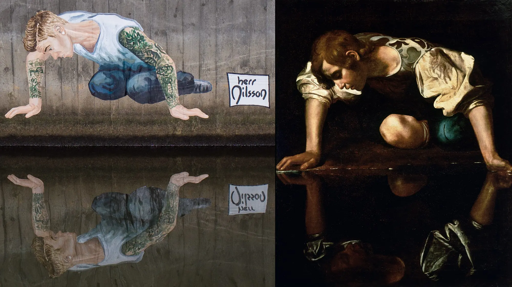
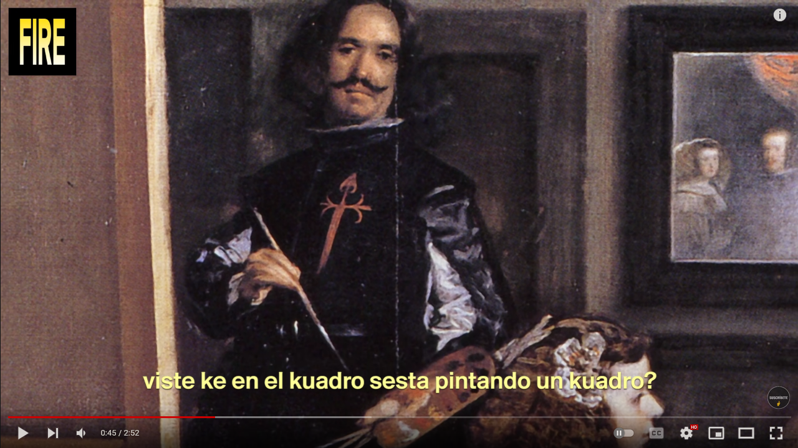

---
title: Projecte de desenvolupament de continguts
subtitle: Especialitat de Dibuix
author: Xavier Belanche Alonso
abstract: "En aquest projecte, es reflexiona sobre punts clau per a actuacions de millora en l'aprenentatge a Internet, a partir del Projecte Educatiu de l'IOC i el seu desplegament, i es fa una proposta didàctica concreta a tall d'exemple per desenvolupar una seqüència didàctica sobre el barroc a l'assignatura del batxillerat, Fonament de les arts. Les actuacions de millora es proposen per a tres eixos: creació i publicació dels recursos i materials d'aprenentatge, estratègies de comunicació híbrides: l'aprenentatge *bicrònic* i estratègies d'avaluació formativa i seguiment de l'aprenentatge."
date: 22 de febrer de 2022
lang: catalan
mainfont: Helvetica
mainfontoptions: BoldFont={Helvetica75}
documentclass: extarticle
fontsize: 11pt
linestretch: 1.5
papersize: a4
geometry: left=3.25cm,right=2.75cm,top=2cm,bottom=2.75cm
urlcolor: blue
toc: true
pandocomatic_:
  use-template: pdf
...

# Motivació i interès personal

El fet de dissenyar, redactar i presentar un projecte amb l'objectiu d'optar a una vacant de l'especialitat de Dibuix a l'Institut Obert de Catalunya (IOC) és una ocasió que convida necessàriament a una reflexió personal sobre el recorregut realitzat des que m'hi vaig incorporar al 2008 fins ara, així com sobre els nombrosos reptes que es derivin de la voluntat de continuar-hi quatre anys més (2022-2026).

L'IOC, per la seva naturalesa com a centre de referència en l'àmbit de la *formació a distància i de les noves oportunitats* per als estudiants, ha de ser un espai de reinvenció i actualització permanent del professorat. Gràcies als tretze anys (2008-2022) que he exercit com a docent a l'IOC, he participat de la seva història i he estat protagonista directe d'una fotografia de conjunt del seu funcionament que, en definitiva, m'ha aportat (i em continua aportant) un coneixement i una experiència professional inèdita amb relació a un projecte educatiu d'**ensenyament-aprenentatge (EA) a Internet**. D'altra banda, la singularitat de l'IOC obre una porta a desenvolupar un perfil professional més polivalent, transversal i, per tant, no confinat únicament a la pràctica docent. En aquest sentit, aquest projecte vol proposar un exercici polièdric, com ho han estat i ho són els diferents projectes de caràcter transversal en què he pres part activament tant en el procés de creació com d'implantació.

## Docència i projectes a l'IOC (2008-2022)

En primer lloc, he estat responsable del disseny i metodologia de les aules (recursos i activitats) de les matèries següents de batxillerat de la modalitat d'arts:

* Fonaments de les arts I
* Dibuix artístic II
* Volum
* Tècniques d'expressió graficoplàstica

En segon lloc, la col·laboració en projectes transversals de centre o específics d'altres estudis de l'IOC ha significat per a mi una de les estratègies més genuïnes de compromís amb el centre de treball. En el context de la complexitat d'un centre com l'IOC, entenc aquest compromís com un pas necessari per trencar les inèrcies i compartiments estancs dels diferents estudis i consolidar una lectura més de conjunt i, en conseqüència, incorporar noves maneres consensuades de fer com a retorn de l'aprenentatge de l'experiència assolida a la docència:

* De l'any 2009 fins al 2011 vaig coliderar el **procés de transició de la creació i publicació de materials d'estudi de la Formació Professional (FP)** del servei d'una empresa associada a la producció de materials de la UOC[^eurekamedia] a la d'un entorn wiki de creació pròpia[^wiki]. Aquest colideratge o treball horitzontal entre els diferents actors implicats (equip directiu, professorat, enginyers informàtics, editors, grafistes) va afavorir la consolidació d'una infraestructura interna de l'IOC ([https://dokuwiki.ioc.cat/doku.php](https://dokuwiki.ioc.cat/doku.php)), que és vigent i operativa a dia d'avui.
* De l'any 2011 fins al 2018, en la doble vessant d'ideòleg i de responsable del disseny web, vaig participar en el desenvolupament del projecte **miniops**[^miniops], cursos oberts, interdisciplinaris i de curta durada (15 a 20 hores), a disposició via web de tota la comunitat educativa i, alhora, estratègics en els estudis del GES (permeten acreditar mòduls optatius). Des del 2019 fins al dia d'avui, col·laboro en el disseny i desenvolupament tècnic del miniop *Llegir en xarxa*.
* Des del 2014 fins al 2016 vaig col·laborar, per una banda, amb la direcció de l'IOC per a la implementació del cicle formatiu de grau superior d'**Animacions 3D, jocs i entorns interactius** i, d'altra banda, la redacció de dues unitats formatives: *Generació de textures procedimentals 2D i 3D i mapa de bits*[^uf1] i *Introducció al disseny de videojocs*[^uf2].
* Al 2015 vaig definir el disseny de cobertes dels materials d'estudi de la **Formació Pedagògica i Didàctica** (FPD)[^fpd] i em vaig encarregar de la realització i posada en marxa del recurs *Repositori audiovisual d’educació de la Formació pedagògica i didàctica per exercir de professor*[^fpdvideos].
* Del 2008 ençà, he pres part en diferents **equips de millora dels estudis de batxillerat**, en particular en aquells centrats en el disseny i creació de documents marc del professorat responsable i col·laborador.
* El març del 2020 vaig compartir amb la direcció acadèmica de batxillerat una **proposta de projecte de *materials***[^projecte_materials] per als estudis de batxillerat on feia una anàlisi de l'estat actual de les diferents estratègies de creació i publicació de recursos d'aprenentatge  i facilitava orientacions generals per a la concreció d'un nou marc de l'edició i publicació dels materials als estudis de batxillerat.

[^wiki]: En una primera fase, l'IOC va contractar els serveis d'una empresa externa ([Scopia](https://www.scopia.es/) per a la importació dels materials d'FP (en format PDF) a una wiki personalitzada basada en la plataforma de codi lliure [Dokuwiki](https://www.dokuwiki.org/dokuwiki).

[^eurekamedia]: *Eureka media* llavors, avui *Oberta Publishing*.

[^miniops]: Vegeu [http://miniops.ioc.cat/](http://miniops.ioc.cat/)

[^fpd]: Vegeu [https://ioc.xtec.cat/educacio/fpd](https://ioc.xtec.cat/educacio/fpd)

[^fpdvideos]: Vegeu la pàgina del repositori de vídeos de l'FPD: [http://fpd.ioc.cat/videos/](http://fpd.ioc.cat/videos/)

[^uf1]: Consulteu en aquesta adreça el material d'estudi: [https://ioc.xtec.cat/materials/FP/Recursos/fp_a3d_m04_/web/fp_a3d_m04_htmlindex/media/fp_a3d_m04_u4_pdfindex.pdf](https://ioc.xtec.cat/materials/FP/Recursos/fp_a3d_m04_/web/fp_a3d_m04_htmlindex/media/fp_a3d_m04_u4_pdfindex.pdf)

[^uf2]: Consulteu en aquesta adreça el material d'estudi: [https://ioc.xtec.cat/materials/FP/Recursos/fp_a3d_m07_/web/fp_a3d_m07_htmlindex/media/fp_a3d_m07_u3_pdfindex.pdf](https://ioc.xtec.cat/materials/FP/Recursos/fp_a3d_m07_/web/fp_a3d_m07_htmlindex/media/fp_a3d_m07_u3_pdfindex.pdf)

[^projecte_materials]: Descarregueu des d'aquest enllaç el document del projecte: [http://rotterlyud.ddns.net/projecte_recursos_aprenentatge_batxillerat.pdf](http://rotterlyud.ddns.net/projecte_recursos_aprenentatge_batxillerat.pdf)

# Formulació del projecte

L'actual proposta de projecte comparteix la mateixa motivació i el mateix impuls: mirar d'aportar una resposta a aquelles qüestions o reptes associats a les implicacions d'aprendre a través d'Internet en el context sociocultural actual. La concreció següent de **tres eixos d'actuacions** ajudaran, per una banda, a identificar els diferents i possibles condicionants d'*estudiar davant d'una pantalla*[^Studying-on-a-screen] i, d'altra banda, a perfilar quins són els objectius que haurien de regular l'activitat docent a l'IOC:

* Eix de creació i publicació dels recursos i materials d'aprenentatge
* Eix d'estratègies de comunicació híbrides: l'aprenentatge *bicrònic*
* Eix d'estratègies d'avaluació formativa i seguiment de l'aprenentatge

[^Studying-on-a-screen]: Recomano la lectura de la pàgina [Studying on a screen](https://help.open.ac.uk/studying-on-a-screen) del [Help Center](https://help.open.ac.uk/) de l'Open University.

## Eix estratègic del disseny i publicació dels recursos d'aprenentatge

Segons el Projecte Educatiu de Centre (PEC) de l'IOC, "l’ús de material d’estudi divers garanteix tres funcions: construcció del coneixement, exercitació dels sabers i mobilització dels sabers. Aquest material ha evolucionat des del material en PDF fins al material integrat al format Moodle (llibres Moodle, lliçons) juntament amb altres canals diversificats de presentació de la informació com l’audiovisual"[^pec-material-estudi-0]. Així doncs, els materials d'estudi, representen un element estratègic en el procés de l'EA de l'IOC ja que responen a l'exigència dels continguts i objectius curriculars i han de formar part de l'entorn virtual d'aprenentatge (EVA) de l'IOC.

Si bé el PEC de l'IOC tracta de procés *evolutiu* el pas del material PDF a "format Moodle", és a dir, en *llibre de Moodle* o *lliçons* (amb la integració lògica de recursos audiovisuals com diapositives, vídeos o interaccions H5P), el cert és que aquesta mirada situa l'EVA de l'IOC com a espai estratègic d'edició i publicació dels materials i recursos d'estudi de les aules sense cap qüestionament o reflexió prèvia de com haurien de ser els materials d'estudi en l'actual context d'estudiar a Internet. Al meu entendre, en abordar aquest procés evolutiu, cal tenir en compte els cinc punts següents:

* Els entorns virtuals d'aprenentatge, com és el cas del Moodle de l'IOC, són espais centrats en la pràctica de l'EA virtual i no pas un servei de publicació (o de gestió documental). L'evidència més immediata, la trobem al comparar el nombre i tipologia de recursos i activitats disponibles (fòrums, tasques, wikis, qüestionaris, tallers, enquestes, agrupacions...) amb la de recursos (etiqueta, pàgina web, llibre i fitxers) de Moodle.
* Un escenari on els materials d'estudi (*llibres de Moodle* o *lliçons*) acabin formant part de manera indissociable de l'aula contradiu un dels principis pedagògics de la missió de l'IOC, és a dir, la *flexibilitat*[^pec-material-estudi-1]. Incrementar la flexibilitat i les opcions personals dels estudiants en la seva autonomia de pràctica educativa significa proporcionar *no només uns materials d'estudi de qualitat sinó garantir, en la mesura del possible, alternatives de format perquè els estudiants les incorporin als seu hàbitat i hàbits d'estudi*. Cal defensar la cultura i pràctica de la **portabilitat i accessibilitat de la informació** i, en conseqüència, minimitzar l'impacte de qualsevol possible limitació: estudiants amb problemes de visió/lectura en pantalla o de connectivitat (estudiants amb problemes de connectivitat regular o total; estudiants de centres penitenciaris i altres contextos de privació parcial de la llibertat de moviment personal i accés al Campus de l'IOC).
* Pensar el disseny dels recursos d'estudi en clau d'accessibilitat i portabilitat és també valorar solucions complementàries (no substitutòries). Per exemple, la creació de vídeos educatius haurà de venir acompanyada de subtítols i la transcripció textual del contingut.
* No tots els estudiants gaudeixen de dispositius de lectura de pantalla òptims o, d'altra banda, és molt més que probable que molts estudiants consultin els recursos d'estudi de l'aula  *des dels seus dispositius de lectura habitual* (per exemple, des del mòbil). Per això, és necessari *pensar en un disseny de recursos d'estudi que siguin òptims per al context del dispositiu de lectura dels estudiants*. El format dels materials d'estudi ha d'adaptar-se a l'exigència o realitat de l'estudiant perquè aquell sigui lliure a decidir quin d'aquests és el més adequat a les seves necessitats.
* Confinar els materials d'estudi a les limitacions conegudes de l'EVA de l'IOC és, segons la meva opinió professional, un error. Calen estratègies de publicació i visibilitat *en obert* (i no em refereixo dins d'una exportació des de l'aula Moodle) que consolidin tant les estratègies de portabilitat i accessibilitat dels recursos d'estudi de les aules com, i no menys important, considerar l'EVA de l'IOC l'espai on es duu a terme, principalment, el procés d'EA dels estudiants.

En aquesta direcció, una part significativa del disseny dels recursos d'estudi en les aules de les matèries que imparteixo a l'IOC estan inspirades en projectes públics com [Smart History](https://smarthistory.org/),  [Khan Academy](https://www.khanacademy.org/), projectes personals com [The Art Assignment](https://www.youtube.com/user/theartassignment), però també en totes aquelles propostes d'actualitat associades a entitats culturals del territori  (MACBA, CCCB, MNAC, Fundació Miró...) o internacionals (Tate Modern, MET, MoMA...). Totes elles, en conjunt, serveixen d'ajuda, no únicament en el desenvolupament dels materials d'estudi, sinó també en l'oportunitat de definir la presentació i estructura dels materials d'estudi com a **curació de recursos** que ha de satisfer tant l'exigència del currículum com, sobretot, oferir als estudiants uns mitjans per a l'aprenentatge de qualitat i d'actualitat.

La **curació de recursos** ha de combinar recursos de creació pròpia amb aquells de tercers que gaudeixin de llicències que en permetin l'ús, adaptació i publicació. Soc defensor de la idea de **reciclatge** dels recursos, especialment aquells que, pel seu interès, idoneïtat i factura permeten que els estudiants accedeixin a un tipus d'informació que, a més d'encaixar en el relat de la proposta d'EA, amplien la seva mirada o referents.

Finalment, la **curació de recursos** posa en primer pla com ha de ser el disseny seqüencial dels materials d'estudi, en particular en la narrativa (*storytelling*) del conjunt de la seqüència. Crec que aquesta estratègia pot ajudar a temperar moltes de les dificultats que troben els estudiants davant del repte d'estudiar *a distància*.

[^pec-material-estudi-0]: *Projecte educatiu de centre de l'IOC*, (p. 10).

[^pec-material-estudi-1]: ibíd, (p. 7).

## Eix estratègic de comunicació: el model *bicrònic*

> L'ús del correu electrònic és fàcil i ràpid, però potser no és el mitjà més eficaç.[^serarols]

[^serarols]: Serarols i Badia, Jordi, *La dimensió digital en situacions escolars de confinament i postconfinament*, Revista d'Organització Educativa i Gestió Educativa, 2020.

La comunicació és un dels factors clau de l'EA de l'estudiant en el context de les aules virtuals. No és casual que el PEC de l'IOC la identifiqui com a element de vital importància i recomani vetllar per un bon ús i una adient actualització per "garantir la qualitat del projecte"[^pec-ioc-4].

[^pec-ioc-4]: Projecte educatiu de centre de l'IOC, p. 4.

A l'IOC, com a centre d'estudis *a distància*, el sistema destacable de comunicació amb l'estudiant ha estat i és el model *asíncron*, basat en l'ús intensiu d'aquelles eines de comunicació pròpies de l'EVA com, per exemple, el correu intern o fòrums. Aquest model de comunicació ha estat el dominant en la història dels ensenyaments a distància:

* permet un tipus d'interacció que protegeix l'autonomia i flexibilitat dels estudiants amb el professorat, ja que permet la convivència d'estudis amb la família i la feina o altres responsabilitats personals o professionals;
* afavoreix una major comprensió en determinades situacions de comunicació entre els diferents actors que participen a l'aula virtual: l'eficàcia del correu electrònic o de les entrades publicades a un debat de fòrum resideix en el temps flexible tant de lectura, processament, planificació i elaboració del cos del missatge.

Tanmateix, un model comunicació exclusivament *asíncron*, planteja una sèrie de reptes envers la pràctica d'EA a l'EVA[^manresa-bujosa]:

* La comunicació immediata, *síncrona*, la socialització, la interacció diària, l'ús de l'humor, la ironia, la complicitat, el treball amb parelles o amb grup dels estudiants no és possible en la realitat d'un *EA a distància* en comparació amb la realitat diària de la presencialitat. Això exigeix un exercici de prudència i previsió davant de l'exigència explícita del tret més representatiu de l'EA a distància, la comunicació *asíncrona*: com a professorat, ser curosos i utilitzar recursos comunicatius on s'accentuï la *cortesia* amb els estudiants amb qui no hi ha un contacte directe i, per tant, de qui desconeixem la realitat personal i professional. Fa del tot inviable la idea d'*hospitalitat*, tal i com la  defineix el filòsof Byung-Chul Han: "l'alternativa a l'acumulació del mateix, de la uniformitat, és recuperar la comunicació amb l'altre, exposar-se a la seva mirada, la seva veu i el seu pensament"[^hospitalitat].
* L'absència d'una rutina social pròpia de la pràctica educativa presencial en el context dels estudis a distància és un dels principals motius de la *desconnexió*, *manca d'interès* i *abandonament* dels estudiants. El disseny d'aules *a distància* pot acabar convertint-les en espais administratius on predomina, sobretot, l'autoaprenentatge aïllat dels estudiants.
* Les dificultats de familiarització amb l'EVA poden incrementar-se en funció del nivell de competència i els recursos digitals dels estudiants (molt dispars a l'IOC): no tots els estudiants disposen d'una infraestructura de connectivitat i dispositius adients i, en definitiva, òptims segons el plantejament *cèntric* de la institució.
* L'elevat nombre d'estudiants i, per tant, la necessària incorporació de professorat col·laborador en la tasca de comunicació asíncrona i gestió de l'aula pot accentuar un enfocament o aplicació *passius* de la pràctica d'EA i afavorir encara més la *distància* entre els estudiants i el professorat i, per extensió, qualsevol proposta que intenti trencar amb l'absència de participació i apoderament de l'aula per part de l'estudiant. Una interpretació freda abocaria a la comprensió de l'aula com un repositori de materials d'estudi i activitats d'aprenentatge.

[^hospitalitat]: Conferència de Byung-Chul Han, *[L'expulsió de la diferència i el valor de l'hospitalitat](https://www.cccb.org/ca/activitats/fitxa/conferencia-de-byung-chul-han/228169)*, 6 de febrer de 2018, CCCB.

[^manresa-bujosa]: Recomano les intervencions de Catina Bujosa, professora dels estudis del GES i FP de l'IOC i coordinadora del projecte [miniops](http://miniops.xtec.cat), i Mireia Manresa, professora associada del Departament de Didàctica de Llengua i Literatura i professora de l'Institut de Ciències de l'Educació (ICE) de la UAB, al recurs [Idees en línea](https://sites.google.com/ioc.cat/ideesenlinia/presentaci%C3%B3) (abril de 2020).

La recent acceleració tecnològica dels sistemes de comunicació síncrona (en particular, aquells associats a les videoconferències o els nous entorns de xat o missatgeria instantània) i la seva popularitat social han dibuixat un nou escenari que planteja, com a mínim, un qüestionament de l'exclusivitat del model asíncron dels estudis *a distància*: sigui de manera esporàdica o amb certa regularitat (pensem, per exemple, en l'activitat tutorial o en el seguiment dels estudiants de batxillerat en procés d'elaboració del *Treball de recerca*). Arran de l'impacte de la COVID-19, les actuacions de comunicació síncrona conflueixen amb el disseny asíncron de l'aula dels estudis a distància. Tampoc no es pot minimitzar l'impacte que ha significat l'ús intensiu de les comunicacions síncrones, que l'estudiant experimenta contínuament a l'àmbit personal o professional, fet del qual es podria deduir una lectura de *manca d'immediatesa, interacció i visualització* del disseny asíncron de les aules. L'aprenentatge en sincronia entre estudiants i professorat a l'aula virtual trenca, per una banda, els límits definits a l'EVA i, d'altra banda, ajuda els estudiants a preguntar i rebre respostes *a temps real*. Així, la comunicació síncrona beneficia indirectament la realització d'activitats de comunicació *asíncrona* (debats de participació) i, per tant, minimitza la sensació d'aïllament de l'estudiant a l'aula virtual:

>Isolation can be overcome by more continued contact, particularly synchronously, and by becoming aware of themselves as members of a community rather than as isolated individuals communicating with the computer.[^isolation]

[^isolation]: Haythornthwaite, Caroline; Kazmer, Michelle M. , *Bringing the Internet Home: Adult Distance Learners and Their Internet, Home, and Work Worlds*, a *The Internet in Everyday Life*, ed. Barry Wellman and Caroline Haythornthwaite (Malden, MA: Blackwell Publishing, 2002), pp. 431–463 [quote p. 459]. Citat a l'article d'Stefan Hrastinski, [Asynchronous and Synchronous E-Learning](https://er.educause.edu/articles/2008/11/asynchronous-and-synchronous-elearning#fn9), 2008.

En certa manera, el dèficit de comunicació síncrona als entorns d'aprenentatge asíncrons, com passa a l'IOC, és la causa i origen principal de la degradació de l'ús d'aquestes tecnologies de comunicació asíncrona:

* *email overload*[^email_overload_already] o, el que és el mateix, la missatgeria de correu plena de missatges que semblen més aviat part d'una conversa de missatgeria instantània;
* dilatació en el temps i en quantitat de la solució de problemes per correu (problemes de comprensió lectora, d’expressió o de contextualització).
<!-- * o, en el seu defecte, resolucions d'incidències que requereixen un temps de resposta curta o gairebé immediata. -->

[^email_overload_already]: [Email overload already](https://www.reddit.com/r/Professors/comments/ikk85e/email_overload_already/), entrada de subreddit r/Professors del 2021.

És cabdal en la pràctica docent a l'IOC la introducció de pràctiques de comunicació síncrones que redueixin l'impacte que significa, per una banda, l'ús de les comunicacions asíncrones amb finalitats síncrones així com també incorporar els beneficis i avantatges d'actuacions síncrones a les aules, és a dir, una incorporació equilibrada de diferents estratègies de comunicació síncrona/asíncrona amb l'estudiant que representin un pont entre les activitats i els recursos d'aprenentatge sense que això suposi un greuge o detriment del disseny d'aula asíncron. És a dir, la combinació estratègica de l’aprenentatge síncron i asíncron en el que es coneix com a **aprenentatge bicrònic** (*bichronous online learning*)[^bichronous], l'objectiu principal del qual és proporcionar als estudiants l'oportunitat de participar en determinades sessions o activitats síncrones al llarg de la seqüència asíncrona dels recursos i activitats disponibles a l'aula. La definició, objectius, nombre i calendari de les sessions i activitats síncrones dependran tant de la matèria com del nombre d'estudiants i col·laboradors, fet que exigeix una programació i informació als estudiants a l'inici de curs.

<!-- ```{.graphviz dpi=300 format=PNG caption="Model conceptual de l'aprenentatge bicrònic"} -->

<!-- digraph mygraph { -->

<!--   node [shape=record,style=filled,fillcolor="#efefef",fontname=Helvetica,fontsize=5,fontcolor="#2b2b2b",height=0.05,width=0.05,penwidth=0]; -->

<!--   edge [arrowhead=normal,penwidth=0.35,arrowsize=0.35,len=0.15,color="#bfbfbf"]; -->

<!--   root [label ="Aprenentatge bicrònic"]; -->

<!--   1 [shape=point,penwidth=0,height=0, width=0]; -->

<!--   root->1 [ label=" es concreta en la barreja de",fontcolor="#00aeef",fontsize=5,fillcolor=white,arrowhead=none,fontname=Helvetica]; -->

<!--   1->"Actuacions asincròniques"; -->

<!--   1->"Actuacions sincròniques"; -->

<!--   2 [arrowhead=none,shape=point,penwidth=0,height=0, width=0]; -->

<!--   3 [arrowhead=none,shape=point,penwidth=0,height=0, width=0]; -->

<!--   "Actuacions asincròniques"->"Correu intern\nFòrums\nVídeos\nEnquestes\nPresentacions\nPodcasts\nQüestionaris\nTasques\nTaulers de notícies\n..." [label=" Flexibilitat\nAutonomia\nAccès permanent",fontcolor="#00aeef",fontsize=5,fillcolor=white,arrowhead=none,fontname=Helvetica]; -->

<!--   "Actuacions sincròniques"->"Sistema de missatgeria instantània\nVídeoconferències\n..." [label=" Immediatesa\nSocialització\nParticipació\n",fontcolor="#00aeef",fontsize=5,fillcolor=white,arrowhead=none,fontname=Helvetica]; -->

<!-- } -->

<!-- ``` -->

Qüestions associades a orientació i resolució de dubtes sobre la realització d'activitats avaluables, explicacions complementàries... encaixarien com a actuacions síncrones en el cos del disseny asíncron de l'aula sense que, per aquest motiu, representessin un greuge o impacte negatiu en la flexibilitat i autonomia dels estudiants[^argument-bichronous]. Dit d'una altra manera, trobar un equilibri que no acabi per "estressar" la naturalesa asíncrona de les aules i, per tant, acabi per representar més una dificultat afegida que no pas un avantatge per als alumnes.

Aquest sistema bicrònic de l'aprenentatge no és sinó una recreació del que plataformes socials com [Discord](https://discord.com/) proposen amb èxit als seus usuaris: una barreja intel·ligent de fòrums participatius (asincronia) amb l'oportunitat que els usuaris puguin crear espais de comunicació síncrona (retransmissió en directe, videoconferències o *audio rooms*) de manera àgil i immediata.

[^bichronous]: *Bichronous Online Learning: Blending Asynchronous and Synchronous Online Learning*, Florence Martin, Drew Polly and Albert Ritzhaupt Published: Tuesday, September 8, 2020: [https://er.educause.edu/articles/2020/9/bichronous-online-learning-blending-asynchronous-and-synchronous-online-learning](https://er.educause.edu/articles/2020/9/bichronous-online-learning-blending-asynchronous-and-synchronous-online-learning)

[^argument-bichronous]: Es podria argumentar en contra d'aquestes actuacions síncrones el greuge comparatiu envers aquells estudiants que, per motius personals o professionals, no tinguessin l'opció d'assistir-hi. Sobre això es podria contraargumentar que totes les sessions síncrones són susceptibles de ser enregistrades amb el permís explícit dels assistents. L'estudiant, encara que no hagi pogut assistir a una sessió síncrona anunciada al calendari de curs, podria plantejar tots aquells dubtes o qüestions relacionades amb la temàtica a través de canals asíncrons.

## Eix estratègic d'avaluació i seguiment de l'estudiant

L'avaluació forma part del grup dels principis pedagògics del PEC de l'IOC: s'interpreta com "una eina que potencia l'autoregulació de l'alumne, proporcionant informació sobre el seu procés d'aprenentatge"[^pec-avaluacio-ioc]. La informació que reben els estudiants al llarg del curs, en la forma de correcció o **retroacció** (*feedback*) del professorat, serà un dels elements clau en l'assoliment dels objectius i competències definides al currículum en el marc d'un disseny asíncron de l'aula virtual. L'*autoregulació* del procés d'aprenentatge de l'estudiant basada en l'acompanyament del professorat a través d'una **retroacció** efectiva, precisa i constructiva, defineix l'ideari dels estudis *a distància* de l'IOC.

Si la **retroacció** serveix tant a l'alumne per saber què ha fet bé i de quina manera pot millorar com al professorat per conèixer el grau d'èxit del disseny de les activitats plantejades, cal tenir-ne present aquelles estratègies que ens permetin trobar un equilibri a l'hora de donar una resposta de qualitat i "les possibilitats de fer-ho de manera àgil"[^carme-duran], ja que, a vegades, es presenten escenaris poc favorables com, per exemple, un nombre elevat d'estudiants a l'aula, el perfil heterogeni d'estudiants o la conciliació entre el grau d'exigència de la tasca correctora dels col·laboradors i la seva remuneració. Per tal de conjurar aquests escenaris poc favorables, cal considerar:

* la **planificació** dels criteris d'avaluació relacionats amb els objectius d'aprenentatge i les competències a desenvolupar tant al nivell de seqüència com en el de cadascuna de les activitats amb explicitació dels indicadors corresponents,
* les diferents **tipologies de retroacció** segons l'activitat: des de les correccions automàtiques o basades en escales (qüestionaris o fòrums) a manuals (tasques o preguntes obertes) passant per les rúbriques o guies d'avaluació. Les retroaccions manuals acostumen a ser **individuals**, però també és profitós encabir-hi les **sessions d'avaluació en grup** en un format asíncron (enregistrament d'un vídeo valorant els diferents treballs lliurats) o com a proposta d'una sessió síncrona;
* ús de diferents **formats** de la retroacció manual. La retroacció no s'ha de limitar únicament a la redacció d'un text, pot ser un vídeo (en el context de la modalitat d'arts, en matèries com Dibuix artístic o tècnic, la correcció dels treballs dels estudiants a través de vídeos resulta més que imprescindible) o un àudio;
* la **intervenció de diversos agents** per incloure diferents tipus d'avaluació (autoavaluació, heteroavaluació, coavaluació) i que aquesta esdevingui significativa i competencial;
* la **inclusió d'activitats per compartir dubtes** relacionats amb la realització de les activitats o la comprensió dels recursos pot resultar una evidència a avaluar durant el procés d'aprenentatge. Aquest tipus d'activitats exigeix una resposta ràpida i contextualitzada que ajudi l'estudiant a avançar i, alhora, se'n pot treure un rèdit didàctic per proporcionar indicacions en clau d'ampliació d'interès general.

Així mateix, la publicació de l'esborrany de la futura ordenació dels ensenyaments de batxillerat[^batxillerat-nova-ordenacio] se centrarà en l'enfocament competencial de l'aprenentatge i definirà, no només la "construcció d'uns itineraris flexibles"[^nou-curriculum-batxillerat-0]  de cadascuna de les matèries, sinó també la manera d'avaluar i, en conseqüència, la **redefinició del disseny de les activitats** a l'aula. Una avaluació per competències passa, per tant, per un enfocament d'activitats amb estratègies d'adquisició de coneixement transversal que ajudin l'alumne a ser plenament autònom davant dels reptes de "problemàtiques derivades de l'àmbit acadèmic, dels mitjans de comunicació o de la vida quotidiana"[^nou-curriculum-batxillerat-1].

Quines tipologies d'activitats disponibles a l'EVA de l'IOC (Moodle) encaixarien millor davant dels reptes competencials del futurs disseny curricular del batxillerat? Considero que un treball d'avaluació formativa basada en la **retroacció** personal i de grup, tant en la seva vessant asíncrona com síncrona, ha de representar, per una banda, el referent per pensar els tipus d'activitats com, d'altra banda, l'agent modelador del disseny de les activitats. Dit d'una altra manera, caldrà potenciar aquelles activitats del procés formatiu de l'estudiant on rebi una **retroacció** individual, regular i de qualitat, amb un format que correspongui amb la proposta de l'activitat (text, àudio, vídeo o, fins i tot, si escau, videoconferència) o, amb previsió i amb sintonia amb l'eix d'actuacions de **comunicació bicrònica**, sessions de grup que facilitin la comprensió en conjunt dels resultats o treball elaborat dels estudiants. Dins de l'oferta d'activitats disponibles al Moodle identifiquem:

* les *preguntes obertes* dels qüestionaris que, a banda de l'exigència d'una retroacció humana sobre una automatitzada, proporcionen la possibilitat de jugar amb l'aleatorietat de l'enunciat;
* el lliurament de *tasques* amb activitats a desenvolupar que interpel·lin l'estudiant i el motivin cap a l'elaboració d'un producte de recerca i creació i, per tant, susceptible de lliurar un resultat que no sigui únicament un document de text;
* el *taller per parelles* que accentua el valor de l'autoavaluació de l'estudiant així com l'adopció natural dels criteris d'avaluació de l'activitat en el moment que s'exigeix a l'estudiant l'avaluació de treballs d'altres estudiants (coavaluació);
* els *fòrums d'aprendre en col·laboració*, on els estudiants participen i contribueixen de manera col·lectiva per ajudar-se entre iguals en la resolució d'un repte o problema plantejat a l'enunciat de l'activitat. És a dir, quan la **retroacció** ja no prové únicament de la veu del professorat, sinó del mateix conjunt d'estudiants.

No obstant això, aquesta línia de disseny d'activitats basades en un elevat grau de **personalització de la retroacció**, planteja tot un seguit de reptes (o obstacles) que cal tenir presents:

* l'excés d'**inversió de temps**, inassumible si considerem la relació nombre d'estudiants i temps de dedicació del professorat necessari per a la redacció de retroaccions significatives;
* la **diversitat i nombre d'estudiants** que pot arribar a dificultar un cert nivell de qualitat homogènia en les retroaccions ja que aquestes s'han d'adaptar contínuament segons el destinatari (vocabulari, estratègia de comunicació escrita, inclusió d'exemples particulars, esments a l'evolució/no en l'aprenentatge proposat a l'alumne...);
* la **participació de professorat col·laborador** a l'aula i, per tant, la dificultat que representa trobar l'equilibri entre l'exigència de les retroaccions de qualitat (no robotitzades o basades en esquemes/models o casos prefabricats) i el temps de dedicació vinculat a la remuneració;
* la mateixa **organització del calendari** dels estudis a l'IOC també representa un obstacle important en la tasca d'avaluació formativa de l'estudiant. Un calendari uniformat basat més en la supervivència organitzativa que no pas en les necessitats metodològiques de les matèries pot acabar minant o distorsionant la qualitat a què s'aspira.

D'altra banda, la tasca de **seguiment** és clau en el procés de l'avaluació formativa de l'estudiant, però ha d'encarar-se amb els mateixos reptes que he descrit més amunt  i encara dos més que considero igualment importants:

* De quina manera consolidem el *grau de retorn de la retroacció*? És a dir, quin és el grau d'**impacte de la retroacció en l'aprenentatge dels estudiants**? Quines estratègies o eines tenim a l'abast a l'EVA de l'IOC per verificar i validar que els estudiants fan un ús actiu de l'avaluació formativa en l'assoliment dels objectius la matèria? ¿L'avaluació sumativa ha de ser l'únic indicador que tinguem a l'abast per comprovar que l'estudiant va **autoregulant** de manera **autònoma** el seu procés d'aprenentatge, no només perquè assoleixi el resultat requerit a l'avaluació sumativa, sinó especialment per consolidar les competències treballades al llarg de l'avaluació formativa?
* Les dades generades pels estudiants, ¿permeten establir uns indicadors o mètriques que ens ajudin a avaluar el procés formatiu dels estudiants a l'aula? Quins haurien de ser aquests indicadors?

Si bé són qüestions per a les quals, personalment, no trobo una resposta tancada, sí que m'ajuden, pel cap baix, a pensar en algunes possibles estratègies:

* Tal com està plantejada la seqüència d'aprenentatge de les diferents unitats del projecte **miniops**, crec que la solució rau a proposar a l'estudiant un **projecte o repte integrador** a final de semestre de tot el seu procés d'avaluació formativa i que, en definitiva, ajudés a validar l'impacte del conjunt de retroaccions en els estudiants.
* Una altra estratègia de treball podria ser l'ús del servei d'*Anàlisi de Dades Acadèmiques* (ADA)[^ada], que introdueix aquelles actuacions associades a la disciplina del *learning analytics* per interpretar, segons els possibles indicadors, les dades anònimes dels estudiants i proposar l'elaboració d'un informe *a posteriori* (*what went right and what went wrong*) del seguiment dels estudiants durant l'avaluació formativa.

[^pec-avaluacio-ioc]: PEC. p.8

[^carme-duran]: Duran, Carme, *Correccions i feedback en l'educació en línia*, [Idees en línia](https://sites.google.com/ioc.cat/ideesenlinia/avaluaci%C3%B3-cont%C3%ADnua-i-final?authuser=0), (abril de 2020).

[^batxillerat-nova-ordenacio]: *El batxillerat general, la nova modalitat que oferiran una vintena de centres al setembre*, 11/02/2022, TV3: [https://www.ccma.cat/324/el-batxillerat-general-la-nova-modalitat-que-oferiran-una-vintena-dinstituts-al-setembre/noticia/3145371/](https://www.ccma.cat/324/el-batxillerat-general-la-nova-modalitat-que-oferiran-una-vintena-dinstituts-al-setembre/noticia/3145371/)

[^nou-curriculum-batxillerat-0]: *1r esborrany projecte de batxillerat*, p. 1, febrer de 2022.

[^nou-curriculum-batxillerat-1]: íbid. p. 2.

[^ada]: *Anàlisi de Dades Acadèmiques* és un "projecte començat el curs 2016-17 amb l’anàlisi dels resultats obtinguts en els estudis d’FP. Més endavant, s’hi han anat incorporant progressivament les dades de la resta d’estudis: GES, EOI i, finalment, batxillerat i PACFGS", PEC, p. 11-12.

# Objectius

La descripció de l'anterior marc conceptual en la forma de tres eixos estratègics m'ajudarà a concretar quins són els objectius de treball en el context de la pràctica docent a l'IOC.

#. **Eix de creació i publicació dels recursos i materials d'aprenentatge**
   #. Seguint el model establert al projecte [miniops](https://miniops.ioc.cat), obertura dels recursos i materials d'aprenentatge, que haurien d'estar fora del campus de l'IOC i limitació de l'EVA a la realització de la pràctica d'EA amb els estudiants i la consegüent avaluació.
   #. Curació de recursos de qualitat disponibles a Internet amb llicències lliures (per exemple, [Creative Commons](https://creativecommons.org/licenses/?lang=ca) ) i exigència de facilitar subtítols i transcripcions en català com a complement de productes audiovisuals de procedència internacional.
   #. Cerca i anàlisi d'exemples i referències a Internet que ajudin a repensar, millorar i actualitzar en el temps els recursos i materials d'aprenentatge de les matèries de la modalitat d'arts.
   #. Posada a disposició d'un ventall ampli d'**alternatives de formats** dels diferents recursos i materials d'aprenentatge que faciliti a l'estudiant tant l'accés (amb independència del dispositiu) com una lectura òptima en termes d'accessibilitat.
#. **Eix d'estratègies de comunicació híbrides: l'aprenentatge *bicrònic***
    #. Planificació d'actuacions estratègiques de comunicació síncrona a l'aula:
      * El nombre d'aquestes no hauria de significar un impacte negatiu en el disseny asíncron de l'aula.
      * Cal facilitar alternatives als estudiants que no puguin assistir-hi com, per una banda, proposar exemples, preguntes, dubtes o qüestions que es comentaran obertament a la sessió síncrona i, d'altra banda, la publicació de la sessió síncrona com a **VoD**[^VoD] de l'aula.
    #. Incorporació d'estratègies d'amplificació de la comunicació asíncrona pròpies de la cultura d'Internet (per exemple, segons el context de la comunicació --correu intern, fòrums--, l'ús d'*emotes/emojis*, animacions *gifs* o mems personalitzats permetria una experiència d'aprenentatge de l'estudiant *similar* a l'interacció de les aules presencials[^memes-gif]).
    #. Ús adequat dels mitjans de comunicació asíncrona de l'aula i, per tant, evitar transformar el correu intern del l'EVA de l'IOC en una missatgeria instantània o els fòrums de debat en xats.
    #. Valoració de la possible introducció d'altres estratègies de comunicació síncrona que ajudin a evitar la desnaturalització de la comunicació asíncrona de les aules (per exemple, la implementació i ús d'un servei de missatgeria instantània basat en la tecnologia lliure *XMPP*[^xmpp] a l'EVA de l'IOC).
#. **Eix d'estratègies d'avaluació formativa i seguiment de l'aprenentatge**
   #. Disseny d'activitats on el trinomi recerca/reflexió/creació exigeixi a l'alumne un aprenentatge no limitat a la rèplica dels recursos o materials d'aprenentatge.
   #. Proposta d'activitats de diferent tipologia de l'EVA segons les diferents fases de l'avaluació de l'aprenentatge (inicial, formativa, sumativa). Per exemple, l'ús dels fòrums com a activitat preliminar que motivi el conjunt d'estudiants a qüestionar els coneixements previs sobre un determinat tema a partir d'un referent informatiu que actuï com a objecte de debat o controvèrsia.
   #. Proposta temàtica d'activitats que, en la mesura del possible, s'emmarquin en una realitat propera, actual, quotidiana perquè li atorgui un sentit, no només dins del marc teòric de la matèria, sinó també en allò que els estudiants trobin una possible vinculació emocional,
   #. Ús d'aquelles tipologies d'activitats de l'EVA de l'IOC (Moodle) on la **retroacció** sigui clau en el procés de l'avaluació formativa de l'estudiant.
   #. Ús de diferents formats de **retroacció** segons el plantejament o disseny de l'activitat (text, àudio, vídeo...).
   #. Exploració de les possibiltats i avantatges de la comunicació bicrònica per emetre **retroaccions** tant personals com de grup.
   #. Exploració de les possibilitats d'avaluació formativa d'activitats de grup sense la intervenció, però amb el *guiatge invisible*, del professorat (aprenentatge entre iguals).
   #. Exploració de les possibilitats de la realització d'un projecte final com a indicador del seguiment i aplicació dels estudiants de les retroaccions donades al llarg del seu procés d'aprenentatge.
   #. Elaboració d'un informe *a posteriori* a partir de dades recollides en enquestes i en serveis com l'ADA per avaluar la proposta d'avaluació formativa de l'aula.

[^xmpp]: *Extensible Messaging and Presence Protocol*, article de la Wikipedia dedicat al protocol lliure de missatgeria instantània basat en XML: [https://ca.wikipedia.org/wiki/Extensible_Messaging_and_Presence_Protocol](https://ca.wikipedia.org/wiki/Extensible_Messaging_and_Presence_Protocol).

[^memes-gif]: Mulder, Dave, *Social Presence: Photos, Gifs, and Memes*, (9/9/2020): [http://iteach-and-ilearn.blogspot.com/2020/09/social-presence-photos-gifs-and-memes.html](http://iteach-and-ilearn.blogspot.com/2020/09/social-presence-photos-gifs-and-memes.html).

[^VoD]: El concepte de *Video on Demand* és, a dir, l'arxiu de retransmissions en directe és, des de fa uns anys, una de les estratègies clau en l'afavoriment de projecció dels canals a serveis com [Twitch](https://help.twitch.tv/s/article/video-on-demand?language=en_US) o [Youtube Live](https://support.google.com/youtube/answer/6247592?hl=en).

# Exemplificació d'activitat d'aprenentatge: *Tots els barrocs del món*

La activitat d'aprenentatge següent és un exemple vigent i actual d'aplicació d'una part dels objectius definits al plantejament del projecte. Per una banda, il·lustra el meu mètode de treball actual a l'aula i, d'altra banda, hi introdueixo aquelles referències o recomanacions en cursiva que, ara per ara, crec necessàries com a tasques a fer amb el propòsit de millorar l'exercici i procés d'EA dels estudiants. La seqüència didàctica rep el nom de  **Tots els barrocs del món** i està  emmarcada en la matèria comuna d'opció de la modalitat d'arts, **Fonaments de les arts**.

## Context curricular de la matèria

En la modalitat d’arts, els alumnes han de cursar, al llarg dels dos cursos de batxillerat, la matèria comuna d'opció **Fonaments de les arts I i II**, que inclou una bona part dels continguts d’Història de l’art (Decret 142/2008), amb una mirada oberta cap a altres manifestacions artístiques i culturals (arts escèniques, música, disseny i mitjans audiovisuals). El currículum de primer curs arriba fins al segle XVIII i el de segon curs inclou els segles XIX i XX.

Segons el currículum, la matèria de **Fonaments de les arts** comporta el domini de bases teòriques, procediments i actituds que es relacionen amb tres competències fonamentals:

* la competència en la dimensió temporal de les manifestacions artístiques;
* la competència en l'observació, anàlisi i interpretació de les produccions artístiques;
* i la competència en el desenvolupament de la sensibilitat estètica.

Aquest plantejament de la matèria de **Fonaments de les arts** comporta una distància envers un coneixement enciclopèdic i, en canvi, introdueix la necessitat d'un aprenentatge més competencial a partir d'idees artístiques i, per tant, **la importància de la comprensió del fet artístic**. Dit d'una altra manera, es convida l'estudiant a fer una lectura transversal i globalitzada del fet artístic en lloc del discurs historiogràfic més propi de l'enfocament de la matèria d'Història de l'art, on s'estableix un coneixement de les obres artístiques seguint una línia cronològica per estils, noms i obres més representatives de les anomenades *belles arts* de la tradició artística europea. A la matèria de **Fonaments de les arts**, l'estudiant ha d'aprendre a identificar, argumentar, relacionar, dialogar, crear, comunicar i gaudir del fet artístic i, en definitiva, **disposar d'eines per a reflexionar sobre elements fonamentals de l'art a través de referències passades i presents**[^fonaments-arts].

[^fonaments-arts]: Planella Serra, Montserrat i Ferré Carreras, Blanca, *Espai de materials de formació dels docents de Fonaments de les arts*, [https://fonamentsdelesarts.wordpress.com/credits/](https://fonamentsdelesarts.wordpress.com/credits/).

No és casual que la formulació de l'estructura i els criteris generals d'avaluació de la prova de **Fonaments de les arts** de les PAU[^pau-fonaments-arts] incorpori aquesta dimensió competencial, fet que accentua encara més la necessitat d'organitzar el disseny metodològic de l'aula de la matèria perquè els estudiants acabin superant l'examen amb èxit.

Per tant, a més del repte d'acompanyar els estudiants en l'adquisició de les competències i capacitats de reflexió sobre el fet artístic a través d'una mirada àmplia i polièdrica de l'art del passat i del present, ¿com organitzem els continguts de la matèria tal com estan presentats al currículum en el context dels estudis *a distància* del batxillerat de l'IOC (la semestralitat, l'ampli perfil de l'estudiant, però amb molta presència de *visitants*? Com fem la familiarització de l'estudiant amb l'entorn del campus de l'IOC? Com superem els possibles obstacles d'estudiar davant de la pantalla o l'atenció a la diversitat dels estudiants...)?

[^pau-fonaments-arts]: Informació de la matèria Fonaments de les arts dins de la secció de Proves d'accés PAU i PAP: [https://universitats.gencat.cat/ca/proves-acces-PAU-PAP/preparat-PAU/materies-PAU/fonaments-arts/](https://universitats.gencat.cat/ca/proves-acces-PAU-PAP/preparat-PAU/materies-PAU/fonaments-arts/).

## Descripció de l'activitat

A continuació, explico el disseny de la seqüència *Tots els barrocs del món* i, simultàniament, els objectius definits i enumerats a la descripció de la proposta de projecte.

### Contextualització

Una línia de treball amb els estudiants de la modalitat d'arts del batxillerat, coneguda com a **correspondències estilístiques**, és la de visualitzar com algunes idees artístiques associades a moments clau de la història de l'art traspassen els límits temporals fins arribar a avui dia, ja sigui perquè els creadors n'imiten l'estil, els motius o les formes o perquè consideren que viuen en un context sociocultural similar al del període històric de referència. Aquestes pràctiques de reinvenció, d'apropiació, de reinterpretació dels creadors contemporanis poden ajudar els estudiants, mitjançant el diàleg entre obres que participen de correspondències estilístiques i formals del passat amb el present, a una millor comprensió de la complexitat del fet artístic actual (sigui tant aquell que roman silenciós en una galeria d'art contemporani com un videoclip d'una cançó de *trap*) i, també, les circumstàncies del seu context.

En l'itinerari cronològic dels continguts del currículum de la matèria de **Fonaments de les arts**, el barroc històric ocupa, juntament amb el neoclassicisme, el tram final del primer curs de la matèria. L'organització de la matèria en clau competencial permet un plantejament de recorregut més ampli i, per tant, proposar l'anàlisi del barroc als estudiants, no des d'una perspectiva historicista, sinó com a idea artística que, com a etapa històrica esdevinguda principalment al segle XVII, projecta una ombra dels seus trets estilístics i formals a moltes de les produccions o creacions actuals.



### Descripció de l'activitat

Per tant, amb la finalitat de treballar la idea de l'art del barroc des d'una perspectiva transversal i interdisciplinar, es proposa la seqüència didàctica següent.

<!--  -->

#. Presentació d'un recurs d'actualitat que mostri clarament influències estilístiques o referències explícites del fet artístic del barroc històric. Aquest recurs ha de venir acompanyat d'una introducció per tal de contextualitzar-lo. Es plantejaria com a fil de debat de fòrum, alternativament, com a vídeo d'introducció del tema a l'aula. Un exemple de recurs podria ser el videoclip de trap [Velaske, yo soi guapa? (Las Meninas Trap Mix), 2017](https://www.youtube.com/watch?v=Il6p2-40-F0), amb més d'onze milions de visites. Si es proposa un debat d'inici, s'interpel·la l'estudiant a participar-hi a partir de qüestions com:
   * Coneixes *Las Meninas* de Velázquez? Quins elements del quadre et van cridar més l'atenció? Si has tingut l'oportunitat de veure l'obra en directe, comparteix les teves sensacions.
   * Què creus que podria significar aquest fragment de la lletra del trap: *Pero escuche un secreto: yo la estoy pintando a usted ¿Viste que en el cuadro se está pintando un cuadro? Po' en realidad, señora, yo la 'toy pintando a usted (¿¡cómo!?)*.
   * Sent aquesta és una de les obres més representatives del barroc, podries proposar tres elements estilístics que creus que podrien definir la idea artística del barroc?

     *S'interpel·la l'estudiant a introduir-se en el barroc des d'una perspectiva més àmplia, en sintonia amb la proposta curricular i competencial de la matèria, en la forma de pregunta inicial: **L'estil del barroc, és encara vigent avui dia?***

     *Es proposa com a ajuda a la realització del debat inicial una sessió síncrona (una mica després del començament de l'activitat) amb la finalitat de fer una introducció acadèmica del tema de l'activitat a més de la possibilitat de respondre dubtes sobrevinguts. L'enregistrament de la sessió podria incorporar-se com a ajuda a aquells estudiants que no han pogut assistir-hi.*

#. Lliurar recursos d'aprenentatge significatius que permetin a l'estudiant contextualitzar el període històric del barroc i, per tant, establir les pertinents connexions entre les manifestacions artístiques amb fets socials, polítics i culturals.

   *Si no poden ser de realització pròpia, cal cercar aquells recursos que, per la seva qualitat i sintonia, encaixin amb el propòsit o finalitat de la realització de l'activitat d'aprenentatge.*

   *Si és un recurs de vídeo original en un altre idioma, cal la creació de subtítols en català i transcripció del contingut en múltiples formats. Si és un recurs de lectura, cal proporcionar el cos del contingut en diferents formats que en facilitin una lectura òptima segons el dispositiu o hàbits d'estudi de l'estudiant.*

#. Es proposa l'**enunciat de l'activitat d'aprenentatge** perquè l'estudiant interpreti l'estil del barroc històric com una manera de comprendre el fet artístic que perdura en l'actualitat partint d'una selecció o mostra de fets artístics actuals (pel·lícules, videojocs, sèries de televisió, videoclips, còmics, publicitat, reportatges gràfics, fotografia artística, pintura, escultura, *performance*, vídeo art, dansa...).
#. L'objectiu de l'activitat és elaborar un projecte on l'estudiant actuï com a **comissari d'una exposició fictícia** i, per tant, se li demana que enregistri una presentació oral que inclogui els elements següents:
   #. Cerca a Internet obres d'art del barroc històric que consideri que mostren un vincle, paral·lelisme o relació amb obres actuals.

      *Potenciar la competència digital de l'estudiant en l'àmbit de recerca i processament d'informació a Internet.*

   #. Elaboració d'un text que reculli les idees i les evidències sobre les relacions estilístiques que es produeixen entre les obres.
   #. Proposició de preguntes que qüestionin el perquè de les apropiacions formals o estilístiques actuals a partir de productes estètics d'un moment històric anterior.
   #. Deduir i interpretar el context sociocultural actual a partir de les connexions o correspondències entre les obres del passat i del present: *Creus que els creadors actuals consideren que viuen un moment similar al context sociocultural del barroc històric? Aporta exemples de tres similituds.*
   #. Disseny d'una presentació de l'exposició a partir d'un guió que reculli una síntesi de les tres actuacions anteriors (no es suggereix cap eina). En aquest sentit, es pot aprofitar la manca d'instrucció com a excusa perquè els estudiants comparteixin experiències relacionades amb l'ús d'eines o serveis per a la creació de presentacions. El cos de la presentació ha d'estructurar-se en:
      #. Concreció del títol de l'exposició que enunciï el contingut de forma clara i precisa.
      #. Establiment d'un nombre mínim de diapositives que mostrin les relacions (estilístiques o conceptuals) entre les obres actuals proposades a l'enunciat de l'activitat i aquelles obres del barroc històric escollides per l'estudiant.
   #. Finalment, enregistrament i publicació d'un vídeo on defensin el plantejament de l'exposició (diàleg entre passat i actualitat) i, també, una conclusió personal sobre les possibles connexions entre contextos socioculturals separats en el temps.

      *L'activitat planteja treballar les competències digitals com ara la cerca d'informació i l'ús d'eines per a l'elaboració i publicació de la presentació.*

### Avaluació de l'activitat

S'identifiquen tres actuacions avaluadores de l'activitat:

* una avaluació inicial basada en la participació al fòrum i, en concret, en les aportacions que fonamentin dinàmiques d'aprenentatge entre iguals;
* una segona avaluació basada en la recollida d'informació realitzada per l'estudiant dins del context del seu procés d'aprenentatge. Aquesta avaluació, per tant, s'integra en el context ampli de l'assoliment competencial de la matèria i, per tant, els indicadors seran de caràcter transversal.
* una tercera on els estudiants aplicaran l'aprenentatge dels diferents continguts i recursos de la temàtica necessaris per a la realització de l'activitat que es proposa com a **tasca de creació**.

Per tal de facilitar l'apropiació dels criteris i ponderacions de l'avaluació de la tasca, s'inclou, per una banda, una **pauta de comprovació** en el conjunt de l'enunciat de l'activitat amb la finalitat per tal que l'estudiant verifiqui que ha seguit correctament les indicacions, instruccions i orientacions recollides a l'enunciat abans de publicar el seu treball. D'altra banda, s'inclouen els **criteris d'avaluació** de l'activitat en forma de rúbrica amb el desglossament d'indicadors ajustats al cas o mitjançant una *guia d'avaluació* perquè l'estudiant sàpiga com se li avaluarà i qualificarà la feina. Tant la pauta de comprovació com la guia d'avaluació han de servir igualment de referència al professorat responsable o col·laborador per a la tasca d'elaboració de la **retroacció** individual i avaluació de la feina de l'estudiant.

Finalment, com a addenda, es proposa una **revisió del conjunt de les tasques avaluades** perquè afavoreixi tant la reflexió com el sentit crític de l'estudiant. Aquesta revisió podria ser síncrona i en grup, fet que contribuiria a l'intercanvi d'impressions, valoracions personals, formulació de preguntes envers el conjunt de l'activitat i, en especial, el sentit i propòsit últim d'aquesta en el procés de l'aprenentatge local (el perquè de l'actualitat i vigència del barroc) i global (l'anàlisi i comprensió transversal del fet artístic) de la matèria de **Fonaments de les arts**.
